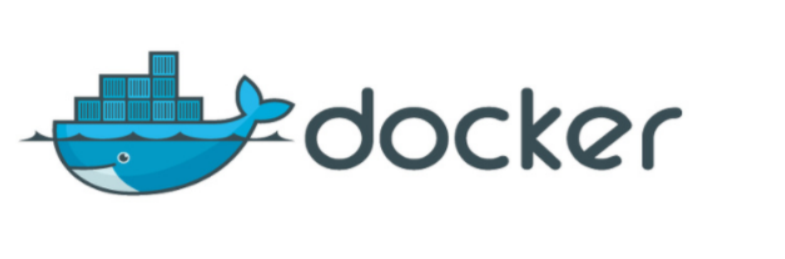
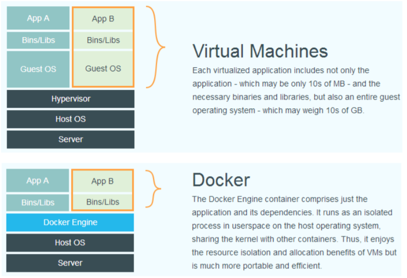
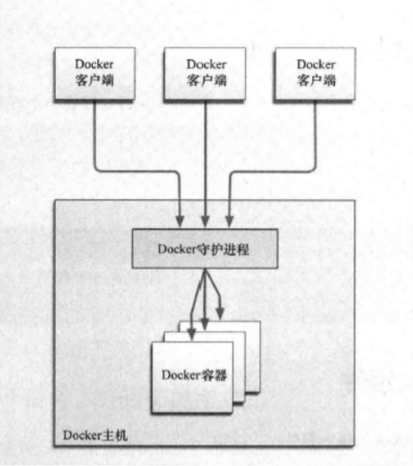

# Docker目录
+ **[Docker简介](#Docker简介)**
    + **[什么是虚拟化](#什么是虚拟化)**
    + **[什么是Docker](#什么是Docker)**
    + **[为什么选择Docker](#为什么选择Docker)**
    + **[容器与虚拟机比较](#容器与虚拟机比较)**
    + **[Docker组件](#Docker组件)**
        + **[Docker服务器与客户端](#Docker服务器与客户端)**
        + **[Docker镜像与容器](#Docker镜像与容器)**
        + **[Registry注册中心](#Registry注册中心)**
+ **[Docker安装与启动](#Docker安装与启动)**
    + **[安装Docker](#安装Docker)**    
    + **[设置ustc的镜像](#设置ustc的镜像)**    
    + **[Docker的启动与停止](#Docker的启动与停止)**
+ **[常用命令](#常用命令)**
    + **[镜像相关命令](#镜像相关命令)**
        + **[查看镜像](#查看镜像)**
        + **[搜索镜像](#搜索镜像)**
        + **[拉取镜像](#拉取镜像)**
        + **[删除镜像](#删除镜像)**
    + **[容器相关命令](#容器相关命令)**
        + **[查看容器](#查看容器)**
        + **[创建与启动容器](#创建与启动容器)**
        + **[停止与启动容器](#停止与启动容器)**
        + **[文件拷贝](#文件拷贝)**
        + **[目录挂载](#目录挂载)**
        + **[查看容器IP地址](#查看容器IP地址)**
        + **[删除容器](#删除容器)**
+ **[应用部署](#应用部署)**
    + **[MYSQL部署](#MYSQL部署)**
    + **[Tomcat部署](#Tomcat部署)**
    + **[Nginx部署](#Nginx部署)**
    + **[Redis部署](#Redis部署)**
+ **[迁移与备份](#迁移与备份)**
    + **[容器保存为镜像](#容器保存为镜像)**
    + **[镜像备份](#镜像备份)**
    + **[镜像恢复与迁移](#镜像恢复与迁移)**
+ **[Dockerfile](#Dockerfile)**
    + **[什么是Dockerfile](#什么是Dockerfile)**
    + **[Dockerfile常用命令](#Dockerfile常用命令)**
    + **[使用脚本创建jdk1.8镜像](#使用脚本创建jdk1.8镜像)**
+ **[Docker私有仓库](#Docker私有仓库)**
    + **[私有仓库搭建与配置](#私有仓库搭建与配置)**
    + **[镜像上传至私有仓库](#镜像上传至私有仓库)**
## Docker简介
### 什么是虚拟化
+ 在计算机中，虚拟化（英语：Virtualization）是一种资源管理技术，是将计算机的各种实体资源，如服务器、网
络、内存及存储等，予以抽象、转换后呈现出来，打破实体结构间的不可切割的障碍，使用户可以比原本的组态更
好的方式来应用这些资源。这些资源的新虚拟部份是不受现有资源的架设方式，地域或物理组态所限制。一般所指
的虚拟化资源包括计算能力和资料存储。
+ 在实际的生产环境中，虚拟化技术主要用来解决高性能的物理硬件产能过剩和老的旧的硬件产能过低的重组重用，
透明化底层物理硬件，从而最大化的利用物理硬件   对资源充分利用
+ 虚拟化技术种类很多，例如：软件虚拟化、硬件虚拟化、内存虚拟化、网络虚拟化(vip)、桌面虚拟化、服务虚拟
化、虚拟机等等。
### 什么是Docker

+ Docker 是一个开源项目，诞生于 2013 年初，最初是 dotCloud 公司内部的一个业余项目。它基于 Google 公司推
出的 Go 语言实现。 项目后来加入了 Linux 基金会，遵从了 Apache 2.0 协议，项目代码在 GitHub 上进行维护。
+ Docker 自开源后受到广泛的关注和讨论，以至于 dotCloud 公司后来都改名为 Docker Inc。Redhat 已经在其
RHEL6.5 中集中支持 Docker；Google 也在其 PaaS 产品中广泛应用。
+ Docker 项目的目标是实现轻量级的操作系统虚拟化解决方案。 Docker 的基础是 Linux 容器（LXC）等技术。
在 LXC 的基础上 Docker 进行了进一步的封装，让用户不需要去关心容器的管理，使得操作更为简便。用户操作
Docker 的容器就像操作一个快速轻量级的虚拟机一样简单。
### 为什么选择Docker
#### 上手快
用户只需要几分钟，就可以把自己的程序“Docker化”。Docker依赖于“写时复制”（copy-on-write）模型，使修改应用程序也非常迅速，
可以说达到“随心所致，代码即改”的境界。随后，就可以创建容器来运行应用程序了。大多数Docker容器只需要不到1秒中即可启动。
由于去除了管理程序的开销，Docker容器拥有很高的性能，同时同一台宿主机中也可以运行更多的容器，使用户尽可能的充分利用系统资源。
#### 职责的逻辑分类
使用Docker，开发人员只需要关心容器中运行的应用程序，而运维人员只需要关心如何管理容器。
Docker设计的目的就是要加强开发人员写代码的开发环境与应用程序要部署的生产环境一致性。
从而降低那种“开发时一切正常，肯定是运维的问题（测试环境都是正常的，上线后出了问题就归结为肯定是运维的问题）”
#### 快速高效的开发生命周期
Docker的目标之一就是缩短代码从开发、测试到部署、上线运行的周期，让你的应用程序具备可移植性，易于构建，并易于协作。
（通俗一点说，Docker就像一个盒子，里面可以装很多物件，如果需要这些物件的可以直接将该大盒子拿走，而不需要从该盒子中一件件的取。）
#### 估计使用面向服务的架构
Docker还鼓励面向服务的体系结构和微服务架构。Docker推荐单个容器只运行一个应用程序或进程，这样就形成了一个分布式的应用程序模型，
在这种模型下，应用程序或者服务都可以表示为一系列内部互联的容器，从而使分布式部署应用程序，扩展或调试应用程序都变得非常简单，同时也提高了程序的内省性。
（当然，可以在一个容器中运行多个应用程序）
### 容器与虚拟机比较
下面的图片比较了 Docker 和传统虚拟化方式的不同之处，可见容器是在操作系统层面上实现虚拟化，直接复用本
地主机的操作系统，而传统方式则是在硬件层面实现。

### Docker组件
#### Docker服务器与客户端
Docker是一个客户端-服务器（C/S）架构程序。Docker客户端只需要向Docker服务器或者守护进程发出请求，服
务器或者守护进程将完成所有工作并返回结果。Docker提供了一个命令行工具Docker以及一整套RESTful API。你
可以在同一台宿主机上运行Docker守护进程和客户端，也可以从本地的Docker客户端连接到运行在另一台宿主机
上的远程Docker守护进程。

#### Docker镜像与容器
+ 镜像是构建Docker的基石。用户基于镜像来运行自己的容器。镜像也是Docker生命周期中的“构建”部分。镜像是基
于联合文件系统的一种层式结构，由一系列指令一步一步构建出来。例如：
    + 添加一个文件；
    + 执行一个命令；
    + 打开一个窗口。
+ 也可以将镜像当作容器的“源代码”。镜像体积很小，非常“便携”，易于分享、存储和更新。
Docker可以帮助你构建和部署容器，你只需要把自己的应用程序或者服务打包放进容器即可。容器是基于镜像启
动起来的，容器中可以运行一个或多个进程。我们可以认为，镜像是Docker生命周期中的构建或者打包阶段，而
容器则是启动或者执行阶段。容器基于镜像启动，一旦容器启动完成后，我们就可以登录到容器中安装自己需要
的软件或者服务。
+ 所以Docker容器就是：
    + 一个镜像格式；
    + 一些列标准操作；
    + 一个执行环境。
+ Docker借鉴了标准集装箱的概念。标准集装箱将货物运往世界各地，Docker将这个模型运用到自己的设计中，唯
一不同的是：集装箱运输货物，而Docker运输软件。
+ 和集装箱一样，Docker在执行上述操作时，并不关心容器中到底装了什么，它不管是web服务器，还是数据
库，或者是应用程序服务器什么的。所有的容器都按照相同的方式将内容“装载”进去。
+  Docker也不关心你要把容器运到何方：
    + 我们可以在自己的笔记本中构建容器，上传到Registry，然后下载到一个物理的或者虚拟的服务器来测试，在把容器部署到具体的主机中。
    像标准集装箱一样，Docker容器方便替换，可以叠加，易于分发，并且尽量通用。
#### Registry注册中心
+ Docker用Registry来保存用户构建的镜像。Registry分为公共和私有两种。Docker公司运营公共的Registry叫做
Docker Hub。用户可以在Docker Hub注册账号，分享并保存自己的镜像（说明：在Docker Hub下载镜像巨慢，
可以自己构建私有的Registry）。
+ https://hub.docker.com/
## Docker安装与启动
### 安装Docker
+ Docker官方建议在Ubuntu中安装，因为Docker是基于Ubuntu发布的，而且一般Docker出现的问题Ubuntu是最
先更新或者打补丁的。在很多版本的CentOS中是不支持更新最新的一些补丁包的。
+ 由于我们学习的环境都使用的是CentOS，因此这里我们将Docker安装到CentOS上。注意：这里建议安装在
CentOS7.x以上的版本，在CentOS6.x的版本中，安装前需要安装其他很多的环境而且Docker很多补丁不支持更
新。
+ 1.yum包更新到最新版
    + `sudo yum update`
+ 2.安装需要的软件包， yum-util 提供yum-config-manager功能，另外两个是devicemapper驱动依赖的
    + `sudo yum install -y yum-utils device-mapper-persistent-data lvm2`
+ 3.设置yum源为阿里云
    + `sudo yum-config-manager --add-repo http://mirrors.aliyun.com/dockerce/linux/centos/docker-ce.repo`
+ 4.安装docker
    + `sudo yum install docker-ce`
+ 5.查看docker版本
    + `docker -v`
### 设置ustc的镜像
+ ustc是老牌的linux镜像服务提供者了，还在遥远的ubuntu 5.04版本的时候就在用。ustc的docker镜像加速器速度
  很快。ustc docker mirror的优势之一就是不需要注册，是真正的公共服务。
+ https://lug.ustc.edu.cn/wiki/mirrors/help/docker
+ 编辑daemon.json文件
    + `vi /etc/docker/daemon.json`
+ 在该文件中给输入以下内容
    ```json
    {
    "registry-mirrors": ["https://docker.mirrors.ustc.edu.cn"]
    }
    ```
### Docker的启动与停止
+ 启动docker
    + `systemctl start docker`
+ 停止docker
    + `systemctl stop docker`
+ 重启docker
    + `systemctl restart docker`
+ 查看docker状态
    + `systemctl enable docker`
+ 开机启动docker
    + `systemctl enable docker`
+ 查看docker概要信息
    + `docker info`
+ 查看docker帮助文档
    + `docker --help`
## 常用命令
### 镜像相关命令
#### 查看镜像
+ `docker images`
    + repository:镜像名称
    + tag:镜像标签
    + image id:镜像id
    + created:镜像的创建日期(不是获取该镜像的日期)
    + size:镜像大小
    + 这些镜像都是存储在Docker宿主机的/var/lib/docker目录下
#### 搜索镜像
+ `docker search 镜像名称`(从网络中查找镜像)
    + name:仓库名称
    + description:镜像描述
    + starts:用户评价
    + official:是否官方
    + automated:自动构建，表示该镜像是否由Docker Hub自动构建流程创建的
#### 拉取镜像
+ 拉取镜像就是从中央仓库中下载镜像到本地
+ `docker pull 镜像名称`
+ 例如，我要下载centos镜像(7表示tag，默认是latest)
+ `docker pull centos:7`
#### 删除镜像
+ 按照镜像id删除镜像
    + `docker rmi 镜像ID`
+ 删除所有镜像
    + docker rmi \`docker images -q`
### 容器相关命令
#### 查看容器
+ 查看正在运行的容器
    + `docker ps`
+ 查看所有容器
    + `docker ps -a`
+ 查看最后一次运行的容器
    + `docker ps -l`
+ 查看停止的容器
    + `docker ps -f status=exited`
#### 创建与启动容器
+ 创建容器常用的参数说明
    + 创建容器命令:`docker run`
    + `-i`:表示运行容器
    + `-t`:标识容器启动后会进去其命令行。加入这两个参数后，容器创建就能登陆进去。即分配一个伪终端。
    + `--name`:为创建的容器命名
    + `-v`:标识目录映射关系(前者是宿主机目录，后者是映射到宿主机上的目录)，可以使用多个 -v 做多个目录或文件映射。
    注意：最好做目录映射，在宿主机上做修改，然后共享到容器上。
    + `-d`:在run后面加上-d参数，则会创建一个守护石容器在后台运行(这样创建容器后不会自动登录容器，如果只加-i -t两个参数，创建后就会自动进去容器)。
    + `-p`:标识端口映射，前者是宿主机端口，后者是容器内的映射端口，可以使用多个-p做多个端口映射
+ (1)交互式方式创建容器
    + `docker run -it --name=容器名称 镜像名称:标签 /bin/bash`
    + 举例：`docker run -it --name=mycentos centos:latest /bin/bash`
        + 当命令执行完之后可以看到前面的命令提示符已经变化，标识命令行已经切换到容器内部
    + 退出当前容器
        + `exit`
        + 使用exit退出容器后使用docker ps会发现当前没有运行的容器,交互式创建容器当退出时容器还存在，只是停止了
+ (2)守护式方式创建容器
    + `docker run -di --name=容器名称 镜像名称:标签`
    + 举例:`docker run -di --name=mycentos2 centos:latest`
    + 进入容器
        + `docker exec -it 容器名称(或者容器ID) /bin/bash`
    + 退出当前容器
        + `exit`
        + 退出由守护式方式创建的容器时，容器依然在运行
#### 停止与启动容器
+ 启动容器
    + `docker start 容器名称(或者容器ID)`
+ 停止容器
    + `docker stop 容器名称(或者容器ID)`
#### 文件拷贝
+ 如果我们需要将文件拷贝到容器内可以使用cp命令
    + `docker cp 需要拷贝的文件或者目录 容器名称:容器目录`
+ 也可以将文件从容器内拷贝出来
    + `docker cp 容器名称:容器给i目录 需要拷贝的文件或目录`
#### 目录挂载
+ 我们可以在创建容器的时候，将宿主机的目录与容器内的目录进行映射，宿主机和容器的目录就会同步
创建容器添加-v参数后变为 宿主机目录:容器目录，例如:
+ `docker run -di -v /usr/local/myhtml:/usr/local/myhtml --name=mycentos3 centos:latest`
+ 如果你共享的是多级的目录，可能会出现权限不足的提示
+ 这是因为centos7中的安全模块selinux把全西安禁掉了，我们需要添加参数--privileged=true来解决挂载目录没有权限的问题
####  查看容器IP地址
+ 我们可以通过以下命令查看容器运行的各种数据
    + `docker inspect 容器名称（容器ID）`
+ 也可以直接执行下面的命令直接输出IP地址
    + `docker inspect --format='{{.NetworkSettings.IPAddress}}' 容器名称（容器ID）`
#### 删除容器
+ 删除指定的容器(正在运行容器必须停止)
    + `docker rm 容器名称(容器ID)`
## 应用部署
### MYSQL部署
+ (1)拉取mysql镜像
    + `docker pull mysql`
+ (2)创建容器
    + `docker run -di --name=tensquare_mysql -p 33306:3306 -e MYSQL_ROOT_PASSWORD=123456 mysql`
    + -p 代表端口映射，格式为 宿主机端口:容器端口
    + -e 代表添加环境变量 MYSQL_ROOT_PASSWORD 是root用户的登录密码
+ (3)远程登录mysql
    + 连接宿主机的IP，指定端口为33306
### Tomcat部署
+ (1)拉取tomcat镜像
    + `docker pull tomcat:7-jre7`
+ (2)创建容器
    + `docker run -di --name=mytomcat -p 9000:8080 -v /usr/local/webapps:/usr/local/tomcat/webapps tomcat:7-jre7`
+ (3)登录宿主机9000去访问容器8000

### Nginx部署
+ (1)拉取nginx镜像
    + `docker pull nginx`
+ (2)创建容器
    + `docker run -di --name=mynginx -p 80:80 nginx`
+ (3)80端口访问
### Redis部署
+ (1)拉取redis镜像
    + `docker pull redis`
+ (2)创建容器
    + `docker run -di --name=myredis -p 6379:6379 redis`
## 迁移与备份
### 容器保存为镜像
+ 将容器存为镜像
    + `docker commit 容器名称 保存的镜像名称`
    + 举例：`docker commit mynginx mynginx_new`
### 镜像备份
+ 将镜像保存为tar文件
    + `docker save -o mynginx.tar mynginx_new`
### 镜像恢复与迁移
+ 在安装了docker的机器上面加载备份的镜像
    + `docker load -i mynginx.tar`
    + 使用 docker images 可以看到镜像已经恢复了
## Dockerfile
### 什么是Dockerfile
+ Dockerfile是由一系列命令和参数构成的脚本，这些命令应用于基础镜像并最终创建一个新的镜像
+ 1.对于开发人员：可以为开发团队提供一个完全一致的开发环境
+ 2.对于测试人员：可以直接拿开发时所构建的镜像或者通过Dockerfile文件构建一个新的镜像开始工作
+ 3.对于运维人员：在部署时，可以实现应用的无缝移植
### Dockerfile常用命令
| 命令 | 作用|
| --- | --- |
| FROM image_name:tag  | 定义了使用哪个基础镜像启动构建流程 |
| MAINTAINER user_name  | 声明镜像的创建者 |
| ENV key value  | 设置环境变量 (可以写多条) |
| RUN command  | 是Dockerfile的核心部分(可以写多条) |
| ADD source_dir/file dest_dir/file  | 将宿主机的文件复制到容器内，如果是一个压缩文件，将会在复制后自动解压 |
| COPY source_dir/file dest_dir/file  | 和ADD相似，但是如果有压缩文件并不能解压 |
| WORKDIR path_dir  | 设置工作目录 |
### 使用脚本创建jdk1.8镜像
+ 1.创建目录
    + `mkdir -p /usr/local/dockerjdk8`
+ 2.下载jdk-8u171-linux-x64.tar.gz并上传到服务器中的/usr/local/dockerjdk8目录
+ 3.创建文件Dockerfile vi Dockerfile
    ```shell script
    #依赖镜像名称和ID
    FROM centos:latest
    #指定镜像创建者信息
    MAINTAINER Jensen Zhan
    #切换工作目录
    WORKDIR /usr
    RUN mkdir /usr/local/java
    #ADD 是相对路径jar,把java添加到容器中,自动解压
    ADD jdk-8u171-linux-x64.tar.gz /usr/local/java/
    #配置java环境变量
    ENV JAVA_HOME /usr/local/java/jdk1.8.0_171
    ENV JRE_HOME $JAVA_HOME/jre
    ENV CLASSPATH $JAVA_HOME/lib/dt.jar:$JAVA_HOME/lib/tools.jar:$JRE_HOME/lib:$CLASSPATH
    ENV PATH $JAVA_HOME/bin:$PATH
    ```
+ 4.执行命令构建镜像
    + `docker build -t='jdk1.8 .`
    + jdk1.8是镜像名称
+ 5.docker images 查看镜像是否创建完成
## Docker私有仓库
### 私有仓库搭建与配置
+ 1.拉取私有仓库镜像
    + `docker pull registry`
+ 2.启动私有仓库容器
    + `docker run -di --name=registry -p 5000:5000 registry`
+ 3.打开浏览器输入地址http://122.51.187.33:5000/v2/_catalog，看到json文件表示私有仓库搭建成功
+ 4.修改daemon.json，让本地docker信任私有仓库
    + `vi /etc/docker/daemon.json`
    + 添加 `"insecure-registries":["122.51.187.33:5000"]`,注意上面行尾加上逗号
+ 5.重启docker服务
    + `systemctl restart docker`
### 镜像上传至私有仓库
+ 1.将要上传的镜像标记为私有仓库镜像
    + `docker tag centos:latest 122.51.187.33:5000/centos7`
+ 2.启动docker私服容器
    + `docker start registry`
+ 3.上传标记的镜像
    + `docker push 122.51.187.33:5000/centos7`
+ 4.查看私服镜像
    + 访问 http://122.51.187.33:5000/v2/_catalog

