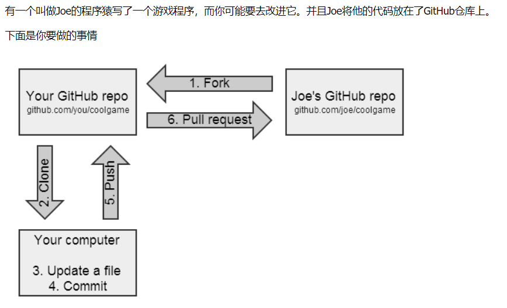

# git目录
+ **[设置全局用户名和邮箱](#设置全局用户名和邮箱)**
+ **[初始化仓库](#初始化仓库)**
+ **[添加文件到暂存区](#添加文件到暂存区)**
+ **[提交文件到仓库](#提交文件到仓库)**
+ **[分支的创建_删除_合并_切换_查看](#分支的创建_删除_合并_切换_查看)**
+ **[标签的添加_删除_查看](#标签的添加_删除_查看)**
+ **[查看工作目录状态](#查看工作目录状态)**
+ **[查看提交历史](#查看提交历史)**
+ **[查看指定的提交对象](#查看指定的提交对象)**
+ **[查看工作区_暂存区_仓库之间的差异](#查看工作区_暂存区_仓库之间的差异)**
+ **[版本回退_撤销操作](#版本回退_撤销操作)**
+ **[备份工作区](#备份工作区)**
+ **[远程仓库的克隆_添加_查看](#远程仓库的克隆_添加_查看)**
+ **[FORK远程项目](#FORK远程项目)**
+ **[小技巧](#小技巧)**
    + **[gitignore失效](#gitignore失效)**
    + **[修改Github上面已有的代码](#修改Github上面已有的代码)**
    + **[本地已有项目上传到GitHub](#本地已有项目上传到GitHub)**
    + **[本地已有项目上传到git私服](#本地已有项目上传到git私服)**
    + **[远程仓库强制覆盖本地仓库](#远程仓库强制覆盖本地仓库)**
    + **[从远程拉取本地没有的分支](#从远程拉取本地没有的分支)**
    + **[远程新建分支后本地看不到最新分支](#远程新建分支后本地看不到最新分支)**
    + **[新建本地分支并推送到远程](#新建本地分支并推送到远程)**
    + **[merge用法](#merge用法)**
## 设置全局用户名和邮箱：
+ `git config --global user.name "yourname"`
+ `git config --global user.email "email@example.com"`
## 初始化仓库
+ `git init`
## 添加文件到暂存区
+ **添加指定文件到暂存区**
    + `git add filename`
+ **添加工作区所有文件到暂存区**
    + `git add .`
+ **交互方式添加文件到暂存区**
    + `git add -i`
+ **将工作区中已经变动的文件添加到暂存区，当新增加的文件不会被添加**
    + `git add -u`
## 提交文件到仓库
+ **提交更新**
    + `git commit -m "描述信息"`
+ **如果工作目录中仅是已跟踪的文件被修改或被删除，使用此命令提交**
    + `git commit -am "描述信息"`
## 分支的创建_删除_合并_切换_查看
+ **查看git仓库中已有的分支**
    + `git branch`
+ **创建分支，如果没有分支起点的话，则默认在当前分支的最新提交上创建分支**
    + `git branch 新分支名 [分支起点]`
+ **切换分支**
    + `git checkout 分支名`
+ **创建同时切换到新分支**
    + `git checkout -b 新分支名`
+ **合并分支**
    + `git merge 要被合并的分支名`
+ **删除指定分支(如果分支没有被合并过，该命令会执行失败)**
    + `git branch -d 要删除的分支名`
+ **删除指定分支，不管有没有被合并过**
    + `git branch -D 要删除的分支名`
+ note
    ```
    合并分支过程中如果发生冲突则需要自己手动解决冲突，然后再提交
    有冲突时，git会显示哪个文件有冲突，并在冲突的文件中加上特殊的标识符号
    解决完冲突后，要手动去掉这些被添加的标示符号
    冲突一般是在不同的分支上对同一文件的同一位置内容进行了改动，并已提交到仓库中，这样在合并的时候就会发生冲突
    ```
## 标签的添加_删除_查看
+ **查看标签**
    + `git tag`
+ **创建简单的标签**
    + `git tag 标签名`
+ **创建附加信息的标签**
    + `git tag -a 标签名 -m "附加信息"`
+ **通过标签查看信息**
    + `git show 标签名`
+ **删除标签**
    + `git tag -d 标签名`
+ note
    ```
    标签可以在需要的地方，为某个提交对象创建别名，这样以后我们就可以通过标签来查看一些信息，创建分支等
    ```    
## 查看工作目录状态
+ `git status`
    ```
    在git命令执行后，要养成通过git status查看git状态的习惯，以便及时了解文件变化的情况
    通过git status可以知道文件的状态
    ```
## 查看提交历史
+ **查看日志**
    + `git log`
+ **显示每次提交文件变化**
    + `git log -p`
    ```
    通过git log可以查看当前分支的所有提交历史，知道每次提交的commit对象的ID以及提交时附加的描述信息等
    要显示更多的信息，需要使用其支持的选项，如`git log -p`可以将每次提交的文件变化也显示出来
    ```    
## 查看指定的提交对象
+ **查看指定的某次提交内容**
    + `git show commit_id`
+ **显示所有的提交历史内容**
    + `git show --all`
+ **显示总的提交次数**
    + `git shortlog -s -n`
```
通过git log可以显示整个提交历史，而通过git show commit_id则可以查看指定的某次提交内容
当然git show -all也可以显示出提交历史，另外还可以格式化显示内容
commit_id可以是commit对象对应的ID，也可以是HEAD，分支名，tag等
```    
## 查看工作区_暂存区_仓库之间的差异
+ **比较工作区与暂存区的差异**
    + `git diff`
+ **比较工作区与仓库中最近一次的提交间的差异**
    + `git diff HEAD`
+ **比较暂存区与仓库中最近一次提交的差异**
    + `git diff --cached`
+ **可以列出该文件每次被修改的时间和内容**
    + `git blame filename`
## 版本回退_撤销操作
+ **显示提交历史的简介**
    + `git reflog`
+ **丢弃工作区的修改(文件没有添加到暂存区)**
    + `git checkout -- filename`
+ **恢复工作区被删除的指定文件(文件之前被提交到仓库中)**
    + `git checkout -- filename`
+ **恢复工作区中所有被删除的文件(文件之前被提交到仓库中)**
    + `git checkout -f`
+ **列出工作区被删除的文件(文件之前被提交到仓库中)**
    + `git ls-files -d`
+ **回退到上一个版本**
    + `git reset --hard HEAD^`
+ **回退到指定版本**
    + `git reset --hard commit_id`
## 备份工作区
+ **将工作区文件保存在git内部栈中**
    + `git stash`
+ **列出git内部栈中保存的工作区文件列表**
    + `git stash list`
+ **恢复工作区到指定的内部栈状态**
    + `git stash applu stash_id`
+ **恢复工作区到上一个内部栈状态**
    + `git stash pop`
+ **清空git内部栈**
    + `git stash clear`
+ note
    ```
    如果正在一个develop分支上开发新功能，但这时master突然发现了bug，需要及时修复，而develop分支的工作还没有完成，
    且不希望之前的工作就这样提交到仓库中时，可以使用git stash来暂时保存这些状态到`git内部栈`中，
    并用当前分支上一次的提交内容来恢复工作目录，然后切换到master分支进行bug修复，等修复完毕并提交到仓库上后，
    再使用git stash apply [stash@{0}]或者git stash pop将工作目录恢复到之前的状态，继续之前的工作
    ```
    ```
    同时也可以多次使用git stash将未提交的代码压入到git栈中，但当多次使用git stash命令后，git栈里充满了未提交的代码，
    这时候到底要用哪个版本来恢复工作目录呢？git使用git stash apply stash@{1}就可以用版本号为stash@{1}的内容来恢复工作目录
    ```
    ```
    当git栈中所有的内容都被恢复后，可以使用git stash clear来将栈清空
    ```
## 远程仓库的克隆_添加_查看
+ **查看已添加的远程仓库名**
    + `git remote`
+ **查看已添加的远程仓库名和地址**
    + `git remote -v`
+ **查看远程仓库信息**
    + `git remote show 远程仓库名`
+ **查看所有远程仓库**
    + `git remote show`    
+ **在本地添加远程仓库**
    + `git remote add 远程仓库名 远程仓库地址`
+ **在本地删除添加的远程仓库**
    + `git remote rm 远程仓库名`
+ **重命名远程仓库**
    + `git remote rename 原名 新名`
+ **克隆远程仓库到本地**
    + `git clone 远程仓库地址 [克隆到指定的文件夹]`
+ **从远程仓库抓取最新数据到本地但不与本地分支进行合并**
    + `git fetch 远程仓库名`
+ **从远程仓库抓取最新数据并自动与本地分支进行合并**
    + `git pull 远程仓库名 本地要合并的分支名`
+ **将本地仓库推送到远程仓库中**
    + `git push 远程仓库名 本地分支名`    
+ **将标签推送到远程仓库(git默认不推送标签)**
    + `git push 远程仓库名 标签名`
## FORK远程项目

+ 1.Fork他的仓库：这是github操作，这个操作会复制Joe的仓库(包括文件，提交历史，issues，喝其余一些东西)。
复制后的仓库在你自己的github账号下。目前，你本地计算机对这个仓库没有任何操作。
+ 2.Clone你的仓库：这是git操作。使用该操作让你发送"请给我发一份我仓库的复制文件"的命令给github。
现在这个仓库就会存储在你本地计算机上。
+ 3.更新某些文件：现在，你可以在任何程序或者环境下更新仓库里面的文件。
+ 4.提交你的更改：这是git操作。使用该操作让你发送"记录我的更改"的命令给github。此操作只在本地计算机上完成。
+ 5.将你的更改push到你的github仓库：这是git操作。使用该操作让你发送"这是我的修改"信息给github。push操作不会
自动完成，所以直到你做了push操作，github才知道你的提交。
+ 6.给Joe发送一个pull request：如果你认为Joe会接受你的修改，你就可以给他发送一个pull request。这是github操作，使用此操作
可以帮助你喝Joe交流你的修改，并且询问Joe是否愿意接受你的"pull request"，这取决于Joe。
+ 7.如果Joe接受了你的pull request，他将把那些修改拉到自己的仓库。
+ note
    ```text
    在本地编辑内容前必须执行pull操作同步别人的远端(这样避免冲突)
    ```
## 小技巧
### gitignore失效
+ 原因
    + 在.gitignore添加规则前就已经被纳入git版本管理
+ 解决办法
    + `git rm -r --cached .`
    + `git add .`
    + `git commit -m "description" `
### 修改Github上面已有的代码
+ 1.本地git与github通过ssh绑定则省略此步骤
    + 本地生成密钥(后面为github账户),一路回车即可
        + `ssh-keygen -t rsa -C 542813934@qq.com`
    + 上面执行成功后本地用户下的.ssh目录下会生成id_rsa.pub文件,将文件里面的一大串复制
        + 进入你的GitHub->settings->SSH keys->new ssh key。将key复制到里面
+ 2.git clone xxx、
+ 3.修改文件
+ 4.在想要上传的项目右击git bash
    + git add .   
    + git commit -m "z"   
    + git push origin master
### 本地已有项目上传到GitHub
+ 1.本地git与github通过ssh绑定则省略此步骤
    + 本地生成密钥(后面为github账户),一路回车即可
        + `ssh-keygen -t rsa -C 542813934@qq.com`
    + 上面执行成功后本地用户下的.ssh目录下会生成id_rsa.pub文件,将文件里面的一大串复制
        + 进入你的GitHub->settings->SSH keys->new ssh key。将key复制到里面
+ 2.github上面建一个空仓库,不要创建README.md
    + repositories -> new -> ......
+ 3.在想要上传的项目右击git bash
    + git init
    + git add .
    + git commit -m "description"
    + git remote add origin git@github.com:zhanzhuang/test.git" 最后一个参数为上面空仓库的地址
    + git push origin master
### 本地已有项目上传到git私服
+ 1.远程仓库生成项目
    + git init --shared=group --bare test.git
    + 关于git多账户无法push的问题，原因是当每个账号提交到git仓库时，新建或修改文件，都是使用当前用户的umask来指定权限的，不同的账户umask不一样，所以push后权限就变了。解决方案有很多，一种最简单的方案是，是在创建git仓库时，指定—shared=group参数
+ 2.本地项目提交
    + git init
    + git add .
    + git commit -m "log"
    + git remote add origin git@xxx.git
    + git push origin master
    
### 远程仓库强制覆盖本地仓库
+ 1.从另一个存储库下载对象和引用
    + git fetch --all
+ 2.放弃本地修改
    + git reset --hard origin/master
+ 3.开始更新
    + git pull
### 远程新建分支后本地看不到最新分支
+ `git remote update origin --prune`
### 从远程拉取本地没有的分支
+ 1.查看远程分支
    + git branch -a
+ 2.拉取并自动切换
    + git checkout -b 本地分支名 origin/远程分支名
+ 3.如果出现提示
    ```text
      fatal: Cannot update paths and switch to branch 'dev' at the same time.
      Did you intend to checkout 'origin/dev' which can not be resolved as commit?
    ```
    需要先执行`git fetch`
    然后再执行拉取并自动切换
### 新建本地分支并推送到远程
+ 1.新建本地分支
    + git checkout dev
+ 2.推送到远程，如果远程没有会自动创建(本地分支：远程分支)
    + git push origin dev:dev
### merge用法
+ **开发分支（dev）上的代码达到上线的标准后，要合并到 master 分支**
    + git checkout dev
    + git pull
    + git checkout master
    + git merge dev
    + git push -u origin master
+ **当master代码改动了，需要更新开发分支（dev）上的代码**
    + git checkout master 
    + git pull 
    + git checkout dev
    + git merge master 
    + git push -u origin dev
### commit了之后取消commit但是代码仍然保留
+ **如果进行了两次commit，想都撤回可以使用2**
    + git reset --soft HEAD~2
+ **如果进行了两次commit，想撤回一个最近的一个commit可以使用1**
    + git reset --soft HEAD~1
    