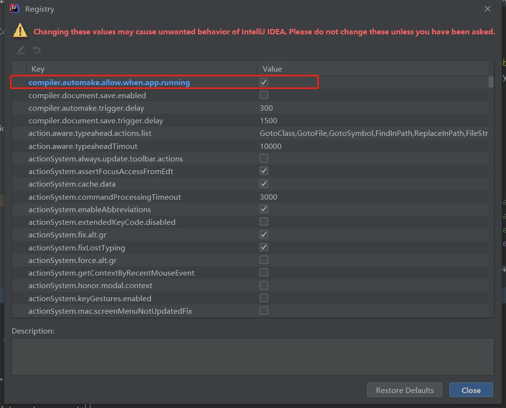
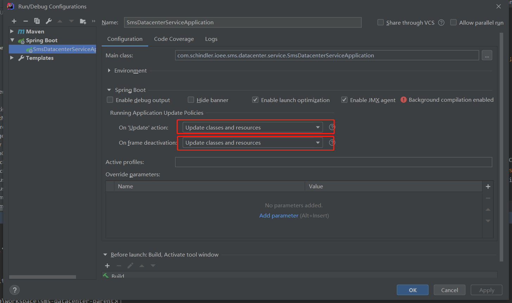

# IDEA技巧
+ **[mac快捷键](#mac快捷键)**
    + **[mac基本](#mac基本)**
    + **[mac查找](#mac查找)**
    + **[mac跳转](#mac跳转)**
    + **[mac替换](#mac替换)**
    + **[mac生成代码](#mac生成代码)**
    + **[macDEBUG](#macDEBUG)**
+ **[windows快捷键](#windows快捷键)**
    + **[windows基本](#windows基本)**
    + **[windows查找](#windows查找)**
    + **[windows跳转](#windows跳转)**
    + **[windows替换](#windows替换)**
    + **[windows生成代码](#windows生成代码)**
+ **[设置](#设置)**
    + **[取消代码重复检查](#取消代码重复检查)**
    + **[Autowired提示报错](#Autowired提示报错)**
    + **[idea新项目默认配置](#idea新项目默认配置)**
    + **[热部署](#热部署)**
    
    
## mac快捷键
### mac基本
+ **启动main方法**`control + R`
+ **启动main方法 macDEBUG** `control + D`
+ **格式化代码**`cmd + option + L`
+ **自动导包**`control + option + O`
+ **上下换行**`option + shift + 上/下`
+ **快速修复**`cmd + enter`
+ **开启新一行**`shift + enter`
+ **切换大小写**`cmd + shift + U`
+ **返回或者前进最近编辑的地方**`cmd + option + 左/右`
+ **定位某一行**`command + L`
+ **连续选中代码块**`option + 上/下`
+ **作用域重命名**`shift + F6`
+ **删除代码**`cmd + x`
### mac查找
+ **当前窗口mac查找文本**`cmd + F`
+ **mac查找文件**`cmd + O`
+ **在全工程中mac查找关键字**`cmd + shift + F`
+ **搜索任何**`shift连按两下`
+ **mac查找最近打开的文件**`cmd + E`
+ **当前方法被谁使用**`option + F7`
### mac跳转


### mac替换
+ **当前窗口mac替换**`cmd + R`
+ **工程中mac替换**`cmd + shift + R`
### mac生成代码
+ **复制一行**`cmd + D`
+ **生成构造器**`cmd + N`
+ **生成try catch**`选中代码块后cmd + option + T`
+ **重写父类方法**`control + O`
+ **实现接口中的方法**`control + I`
### macDEBUG
+ **查看断点信息**`cmd + shift + F8`
+ **计算表达式（可以更改变量值使其生效）** `option + F8`
+ **恢复程序运行，如果该断点下面代码还有断点则停在下一个断点上**`cmd + option + R`
+ **运行到光标处，如果光标前有其他断点会进入到该断点**`option + F9`
+ **下一步(不进入方法)** `F8`
+ **下一步(进入方法)，如果该方法体还有方法，不进入内嵌的方法**`F7`
+ **智能步入，断点所在行上有多个方法调用，会弹出进入哪个方法**`shift + F7`
+ **跳出方法**`shift + F8`
## windows快捷键
### windows基本
+ **格式化代码** `ctrl + alt + L` (可以选中文件夹)
+ **优化导包** `ctrl + alt + O` (可以选中文件夹)
### windows查找
+ **全局搜索关键字** `ctrl + shift + F`
+ **全局搜索类** ``
### windows跳转
### windows替换
### windows生成代码

## 设置
### 取消代码重复检查
file->settings->editor->inspections->general->duplicated code fragment将右侧勾去掉
### Autowired提示报错
file->settings->editor->inspections->spring->spring core->code->autowiring for bean class 将error设置成warning
### idea新项目默认配置
+ file->other settings->preferences for new projects... maven
+ file->other settings->structure for new projects... jdk
### 热部署
+ 1.导入依赖
```xml
<dependency>
    <groupId>org.springframework.boot</groupId>
    <artifactId>spring-boot-devtools</artifactId>
    <scope>rumtime</scope>
    <optional>true</optional>
</dependency>
```
+ 2.添加插件
```xml
<plugin>
    <groupId>org.springframework.boot</groupId>
    <artifactId>spring-boot-maven-plugin</artifactId>
    <configuration>
        <fork>true</fork>
        <addResources>true</addResources>
    </configuration>
</plugin>
```
+ 3.开启idea自动编译  

+ 4.开启运行时编译
    + shift + ctrl + alt + /  ----> register

+ 5.修改启动类

+ 6.重启IDEA