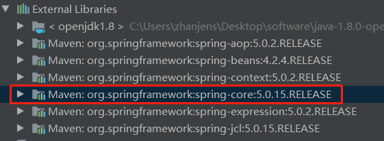

# Maven
+ **[什么是Maven](#什么是Maven)**
+ **[Maven两个经典作用](#Maven两个经典作用)**
    + **[Maven的依赖管理](#Maven的依赖管理)**
    + **[Maven的一键构建](#Maven的一键构建)**
+ **[Maven下载安装](#Maven下载安装)**
+ **[Maven标准目录结构](#Maven标准目录结构)**
+ **[Maven常用命令](#Maven常用命令)**
    + **[compile](#compile)**
    + **[clean](#clean)**
    + **[test](#test)**
    + **[package](#package)**
    + **[install](#install)**
+ **[Maven生命周期](#Maven生命周期)**
+ **[IDEA集成Maven](#IDEA集成Maven)**
+ **[依赖管理](#依赖管理)**
+ **[Maven导入jar包时解决冲突](#Maven导入jar包时解决冲突)**
    + **[第一声明优先原则](#第一声明优先原则)**
    + **[路径优先原则](#路径优先原则)**
    + **[排除法_推荐使用](#排除法_推荐使用)**
+ **[依赖锁定版本](#依赖锁定版本)**
+ **[私服](#私服)**


## 什么是Maven
+ Maven的正确发音是(mei wen)，而不是(ma wen, mai wen)。
+ 一个对Maven比较正式的定义：Maven是一个项目管理工具，它包含了一个**项目对象模型(POM:Project Object Model)**,
一组标准集合，一个项目生命周期(Project Lifecycle),一个依赖管理系统(Dependency Management System),
和用来运行定义在生命周期阶段(Phase)中插件(plugin)目标(goal)的逻辑。
## Maven两个经典作用
### Maven的依赖管理
+ maven对项目中jar包的管理过程
+ 传统项目我们直接把jar包放置在项目中。
+ maven工程真正的jar包防止在仓库中，项目中只用放置jar包的坐标。
### Maven的一键构建
+ maven自身集成了tomcat插件，可以对项目镜像编译，测试，打包，安装，发布等操作。
## Maven下载安装
+ Maven运行依赖java的环境，请确保配置了java的开发环境
+ 地址 https://maven.apache.org/download.cgi

+ 配置环境变量
    + 系统变量中增加`MAVEN_HOME`,变量值为maven安装目录
    + 系统变量Path中追加值，变量值为`%MAVEN_HOME%\bin`
+ 检查
    + `mvn -v`
## Maven标准目录结构
+ src/main/java 核心代码
+ src/main/resources 配置文件
+ src/test/java 测试代码
+ src/test/resources 测试配置文件
+ src/main/webapp 页面资源，js，css，图片等
## Maven常用命令
### compile
+ compile是maven工程编译命令、
+ 作用是将src/main/java下的文件编译为class文件输出到target目录下
+ 不会编译src/main/test目录下的文件
### clean
+ clean是maven工程的清理命令执行
+ clean会删除target目录及内容
### test
+ test是maven工程测试文件编译命令
+ 作用是将src/main/test下的文件编译为class文件放到target目录下
+ 同时也会编译src/main/java下的文件放到target目录下
### package
+ package是maven工程的打包命令
+ 会将src/main/java，src/main/test下的文件编译class文件放到target目录下。
+ 同时会在target目录下生成jar或者war
### install
+ install是maven工程的安装命令
+ 执行isntall将maven打成jar或者war发布到本地仓库
## Maven生命周期
+ 清理生命周期
    + clean
+ 默认生命周期
    + compile -> test -> package -> install -> deploy
+ 站点生命周期
### IDEA集成Maven

下面这个配置是创建maven工程的时候，idea需要联网下载插件，当配置了这句话，idea会先检测本地的插件，如果有，就是用本地的插件。

## 依赖管理
+ A依赖B，需要在A的pom.xml文件中添加B的坐标，添加坐标时需要指定依赖范围，依赖范围包括：
    + compile:编译范围，指A在编译时依赖B，此范围为默认依赖范围。编译范围的依赖会用在编译/测试/运行，由于运行时需要所以编译范围的依赖会被打包
    + provided:provided依赖只有在当JDK或者一个容器已经提供该依赖之后才使用，provided依赖在编译和测试时需要，运行时不需要，比如：servlet api被tomcat容器提供
    + runtime:runtime依赖在运行和测试系统的时候需要，但在编译的时候不需要。比如：jdbc的驱动包。由于运行时需要所以runtime范围的依赖会被打包
    + test:test范围依赖在编译和运行时都不需要，他们只有在测试编译和测试运行阶段可用。比如junit。由于运行时不需要所以test范围依赖不会被打包
    + system:system范围依赖与provided类似，但是你必须显式的提供一个对于本地系统中jar文件的路径，需要指定systemPath磁盘路径，system依赖不推荐使用
+ 依赖范围由强到弱的顺序是： compile>provided>runtime>test

| 依赖范围 | 对于编译classpath有效 | 对于测试classpath有效 | 对于运行classpath有效 | 例子 |
| --- |:---:|:---:|:---:| ---|
| compile | Y | Y | Y | spring-core |
| test | - | Y | - | Junit |
| provided | Y | Y | - | servlet-api |
| runtime | - | Y | Y | JDBC驱动 |
| system | Y | Y | - | 本地的maven仓库之外的类库 |

## Maven导入jar包时解决冲突
### 第一声明优先原则
spring-beans4.2.4声明在上
```xml
<dependency>
    <groupId>org.springframework</groupId>
    <artifactId>spring-beans</artifactId>
    <version>4.2.4.RELEASE</version>
</dependency>
<dependency>
    <groupId>org.springframework</groupId>
    <artifactId>spring-context</artifactId>
    <version>5.0.2.RELEASE</version>
</dependency>
```

spring-beans4.2.4声明在下
```xml
<dependency>
    <groupId>org.springframework</groupId>
    <artifactId>spring-context</artifactId>
    <version>5.0.2.RELEASE</version>
</dependency>
<dependency>
    <groupId>org.springframework</groupId>
    <artifactId>spring-beans</artifactId>
    <version>4.2.4.RELEASE</version>
</dependency>
```

### 路径优先原则
+ 直接依赖比传递依赖路径近，那么最终进入项目的时直接依赖包
```xml
<dependency>
    <groupId>org.springframework</groupId>
    <artifactId>spring-context</artifactId>
    <version>5.0.2.RELEASE</version>
</dependency>
<dependency>
    <groupId>org.springframework</groupId>
    <artifactId>spring-beans</artifactId>
    <version>4.2.4.RELEASE</version>
</dependency>
<dependency>
    <groupId>org.springframework</groupId>
    <artifactId>spring-core</artifactId>
    <version>5.0.15.RELEASE</version>
</dependency>
```


### 排除法_推荐使用
+ 当我们要排除某个jar包下的依赖包，配置exclusions标签内可以不写版本
```xml
<dependency>
    <groupId>org.springframework</groupId>
    <artifactId>spring-beans</artifactId>
    <version>4.2.4.RELEASE</version>
    <exclusions>
        <exclusion>
            <groupId>org.springframework</groupId>
            <artifactId>spring-core</artifactId>
        </exclusion>
    </exclusions>
</dependency>
<dependency>
    <groupId>org.springframework</groupId>
    <artifactId>spring-context</artifactId>
    <version>5.0.2.RELEASE</version>
</dependency>
```


## 依赖锁定版本
```xml
<properties>
    <spring.version>5.0.2.RELEASE</spring.version>
</properties>
<dependencyManagement>
    <dependencies>
        <!--这里只是声明锁定spring jar包版本,声明依赖还是要写在下面-->
        <dependency>
            <groupId>org.springframework</groupId>
            <artifactId>spring-context</artifactId>
            <version>${spring.version}</version>
        </dependency>
    </dependencies>
</dependencyManagement>
<dependencies>
    <dependency>
        <groupId>org.springframework</groupId>
        <artifactId>spring-context</artifactId>
        <version>${spring.version}</version>
    </dependency>
</dependencies>
```

## 私服