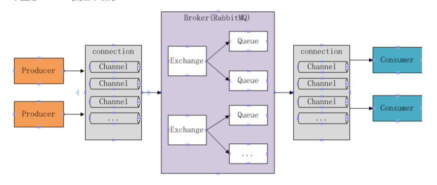
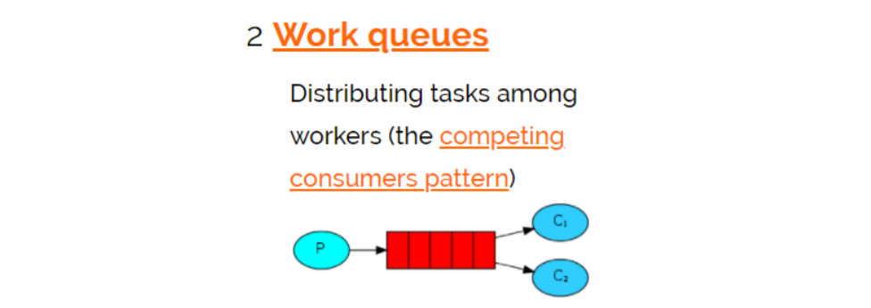
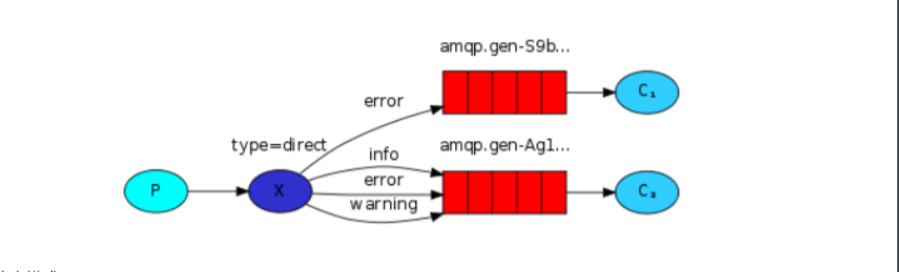
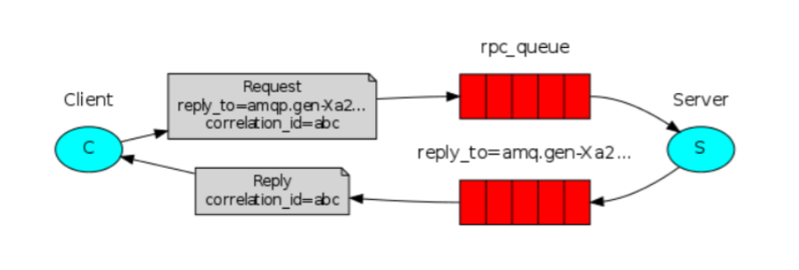

# rabbitMQ目录
+ **什么是RabbitMQ**
    + **开发中消息队列的应用场景**
    + **市场上的其他消息队列**
    + **为什么使用RabbitMQ呢**
    + **什么是AMQP**
    + **什么是JMS(Java消息服务)**
+ **RabbitMQ工作原理**
+ **RabbitMQ下载安装**
+ **简单的生产者**
+ **简单的消费者**
+ **RabbitMQ的六种工作模式**
    + **Work queues**
    + **publish/subscribe**
    + **Routing**
    + **topics**
    + **header**
    + **rpc**
+ **SpringBoot整合RabbitMQ**

## 什么是RabbitMQ
 MQ全称为MessageQueue，即消息队列，RabbitMQ由erlang语言开发，给予AMQP(advanced Message Queue 高级消息队列)协议实现
的消息队列,它是一种应用程序之间的通信方法,消息队列在分布式系统开发中应用广泛
### 开发中消息队列的应用场景
+ 任务异步处理
    + 将不需要同步处理的并且耗时长的操作由消息队列通知消息接收方进行异步处理。提高了应用程序响应时间。
+ 应用程序解耦合
    + MQ相当于一个中介，生产方通过MQ与消费方交互,它将应用程序进行解耦合。
### 市场上的其他消息队列
ActiveMQ RabbitMQ ZeroMQ Kafka MetaMQ RocketMQ Redis
### 为什么使用RabbitMQ呢
+ 1.使用简单，功能强大
+ 2.基于AMQP协议
+ 3.社区活跃，文档完善
+ 4.高并发性能好，得益于Erlang语言
+ 5.Springboot默认已经集成RabbitMQ
### 什么是AMQP
AMQP是一套公开的消息队列协议，最早在2003年被提出，旨在从协议层定义消息通信数据的标准格式，
为的就是解决MQ市场上协议不统一的问题，RabbitMQ就是尊村AMQP标准协议开发的MQ服务
### 什么是JMS(Java消息服务)
JMS是java提供的一套消息服务API标准，其目的是为所有的java应用程序提供统一的消息通信标准，
类似java的jdbc，只要遵循jms标准的应用程序之间都可以进行校信通信，它和AMQP有什么不同，jms是java语言专属的消息服务标准，他是在api层定义标准，并且只能用于java应用。
而AMQP是在协议层定义的标准，是跨语言的。
## RabbitMQ工作原理

+ 组成部分如下
    + Broker：消息队列服务进程，进程包括两个部分：Exchange和Queue
    + Exchange：消息队列交换机，按一定的规则将消息路由转发到某个队列，对消息进行过滤
    + Queue：消息队列，存储消息的队列，消息到达队列并转发给指定的消费方
    + Producer：消息生产者，生产方客户端，生产方客户端将消息发送到MQ
    + Consumer：消息消费者，消费方客户端，接受MQ转发的消息
+ 消息发布流程
    + 1.生产者和Broker建立TCP链接
    + 2.生产者和Broker建立通道
    + 3.生产者通过通道消息发送给Broker，由Exchange将消息进行转发
    + 4.Exchange将消息转发到指定的Queue
+ 消息接收流程
    + 1.消费者和Broker建立TCP连接
    + 2.消费者和Broker建立通道
    + 3.消费者监听指定的Queue
    + 4.当有消息到达Queue时Broker默认将消息推给消费者
    + 5.消费者收到消息
## RabbitMQ下载安装启动
### 下载
RabbitMQ由Erlang语言开发，Erlang语言用于并发以及分布式系统的开发，在电信领域应用广泛，OTP(OPen Telecom Platform)
作为Erlang语言的一部分，包含和很多基于Erlang开发的中间件及工具库，安装RabbitMQ需要安装Erlang/OPT,并保持版本匹配
+ RabbitMQ下载地址
    + https://www.rabbitmq.com/download.html
+ Erlang下载地址
    + http://erlang.org/download/
### 安装
+ erlang
    + 1.双击直接安装即可
    + 2.配置环境变量
        + 系统变量新增 key=ERLANG_HOME value=erlang的安装目录
        + 系统变量path中添加%ERLANG_HOME%\bin
+ RabbitMQ
    + 双击直接安装即可
    + RabbitMQ会自动启动服务
    + sbin目录下的脚本
        + 安装服务：rabbitmq-service.bat instal
        + 启动服务：rabbitmq-service.bat start
        + 停止服务：rabbitmq-service.bat stop
    + 激活RabbitMQ浏览器管理插件
        + 管理员身份在sbin目录下运行：`rabbitmq-plugins.bat enable rabbitmq_management
### 启动
+ 双击 rabbitmq-server.bat
    + 如果提示ERROR: node with name "rabbit" already running on "lhg1"，将rabbitmq的服务关掉即可。
+ 浏览器输入http://localhost:15672/
        
+ 注意事项
    + 1.安装erlang和rabbitmq要用管理员身份
    + 2.当卸载重新安装时会出现rabbitmq服务注册失败，此时需要进入注册表清理erlang 搜索rabbitmq，ErlSrv，将对应的项全部删除
    
## 简单的生产者
依赖
```xml
<dependency>
    <groupId>com.rabbitmq</groupId>
    <artifactId>amqp-client</artifactId>
    <version>5.7.3</version>
</dependency>
```    
代码
```java
public class Producer01 {
    // 队列名称
    private static final String QUEUE = "hello world2";

    public static void main(String[] args) throws IOException, TimeoutException {
        Connection connection = null;
        Channel channel = null;
        try {

            // 创建连接工厂和mq建立连接
            ConnectionFactory connectionFactory = new ConnectionFactory();
            connectionFactory.setHost("127.0.0.1");
            connectionFactory.setPort(5672);
            connectionFactory.setUsername("guest");
            connectionFactory.setPassword("guest");
            // 设置虚拟机,一个mq的服务可以设置多个虚拟机,每个虚拟机就是一个独立的mq
            connectionFactory.setVirtualHost("/");

            // 建立连接
            connection = connectionFactory.newConnection();
            // 创建通道(生产者和mq的通信都在channel中完成)
            channel = connection.createChannel();
            // 声明队列(如果队列在mq中没有就创建)
            /**
             * 参数
             * 1.queue 队列名称
             * 2.durable 是否持久化,如果持久化 mq重启之后队列还在
             * 3.exclusive 是否独占连接，队列只允许在该连接中访问，如果连接关闭队列自动删除，如果将此参数设置true可用于临时队列的创建
             * 4.autoDelete 自动删除，队列不再使用时自动删除，如果将此参数和exclusive参数设置为true就可以实现临时队列
             * 5.arguments 参数，可以设置一个队列的扩展参数，比如可以设置存活时间
             */
            channel.queueDeclare(QUEUE, true, false, false, null);
            // 发送消息
            /**
             * 参数
             * 1.exchange，交换机，如果不指定将使用mq的默认交换机
             * 2.routingKey 路由key，交换机根据路由key将消息发送到指定队列，如果使用默认交换机，routingKey设置为队列的名称
             * 3.props，消息的属性
             * 4.body，消息内容
             */
            String message = "生产者提供的消息1";
            channel.basicPublish("", QUEUE, null, message.getBytes());
            System.out.println("send to mq" + message);
        } catch (Exception e) {
            e.printStackTrace();
        } finally {
            if (channel != null) {
                channel.close();
            }
            if (connection != null) {
                connection.close();
            }
        }

    }
}
```
## 简单的消费者
```java
public class Consumer01 {
    private static final String QUEUE = "hello world";

    public static void main(String[] args) throws IOException, TimeoutException {
        Connection connection = null;
        Channel channel = null;
        try {
            // 创建连接工厂和mq建立连接
            ConnectionFactory connectionFactory = new ConnectionFactory();
            connectionFactory.setHost("127.0.0.1");
            connectionFactory.setPort(5672);
            connectionFactory.setUsername("guest");
            connectionFactory.setPassword("guest");
            // 设置虚拟机,一个mq的服务可以设置多个虚拟机,每个虚拟机就是一个独立的mq
            connectionFactory.setVirtualHost("/");
            // 建立连接
            connection = connectionFactory.newConnection();
            // 创建通道(生产者和mq的通信都在channel中完成)
            channel = connection.createChannel();
            // 声明队列(如果队列在mq中没有就创建)
            /**
             * 参数
             * 1.queue 队列名称
             * 2.durable 是否持久化,如果持久化 mq重启之后队列还在
             * 3.exclusive 是否独占连接，队列只允许在该连接中访问，如果连接关闭队列自动删除，如果将此参数设置true可用于临时队列的创建
             * 4.autoDelete 自动删除，队列不再使用时自动删除，如果将此参数和exclusive参数设置为true就可以实现临时队列
             * 5.arguments 参数，可以设置一个队列的扩展参数，比如可以设置存活时间
             */
            channel.queueDeclare(QUEUE, true, false, false, null);

            // 实现消费方法
            DefaultConsumer defaultConsumer = new DefaultConsumer(channel) {
                // 当接收到消息后系方法被调用
                /**
                 *
                 * @param consumerTag 用来标识消费者，如果设置，在监听队列时设置channel.basicConsume
                 * @param envelope  信封，通过envelope
                 * @param properties 消息属性
                 * @param body 消息内容
                 * @throws Exception
                 */
                @Override
                public void handleDelivery(String consumerTag, Envelope envelope, AMQP.BasicProperties properties, byte[] body) throws IOException {
                    super.handleDelivery(consumerTag, envelope, properties, body);
                    // 交换机
                    String exchange = envelope.getExchange();
                    // 消息id，mq在channel中用来标识消息的额id，可用于确认消息已接收
                    long deliveryTag = envelope.getDeliveryTag();
                    // 消息内容
                    String message = new String(body, "UTF-8");
                    System.out.println("receive message:" + message);
                }
            };
            // 监听队列
            /**
             * 参数
             * 1. queue 队列名称
             * 2. autoAck 自动回复，当消费者接收到消息后要告诉mq消息已经接收，如果将此参数设置为true表示会自动回复mq
             * 如果设置为false要通过变成实现回复
             * 3.callback，消费方法，当消费者接收到消息要执行的方法
             */
            channel.basicConsume(QUEUE, true, defaultConsumer);

        } catch (Exception e) {
            e.printStackTrace();
        } finally {
            // 消费者不能关闭连接，要一直监听消息
        }

    }
}
```
## RabbitMQ的六种工作模式
### Work queues

+ work queues与入门程序相比，多了一个消费端，两个消费端共同消费同一个队列中的消息。
+ 应用场景
    + 对于任务过重或者任务较多情况使用工作队列可以提高任务处理的速度
+ 测试
    + 1.使用入门程序，启动多个消费者。
    + 2.生产者发送多个消息
+ 结果
    + 一个消息只能被一个消费者接收
    + rabbitmq采用轮询的方式将消息平均发送给消费者
    + 消费者在处理完某条消息后才会收到下一条消息

### publish/subscribe

+ 每个消费者监听自己的队列
+ 生产者将消息发送给broker,由交换机将消息转发到绑定次交换机的队列,每个绑定交换机的队列都将接收到消息
```java
public class Producer02_publish {
    private static final String QUEUE_INFORM_EMAIL = "queue_inform_email";
    private static final String QUEUE_INFORM_SMS = "queue_inform_sms";
    private static final String EXCHANGE_FANOUT_INFORM = "exchange_fanout_inform";

    public static void main(String[] args) {
        Connection connection = null;
        Channel channel = null;
        try {
            //创建一个与MQ的连接
            ConnectionFactory factory = new ConnectionFactory();
            factory.setHost("127.0.0.1");
            factory.setPort(5672);
            factory.setUsername("guest");
            factory.setPassword("guest");
            //rabbitmq默认虚拟机名称为“/”，虚拟机相当于一个独立的mq服务器
            factory.setVirtualHost("/");
            //创建一个连接
            connection = factory.newConnection();
            //创建与交换机的通道，每个通道代表一个会话
            channel = connection.createChannel();
            // 声明交换机
            channel.exchangeDeclare(EXCHANGE_FANOUT_INFORM, BuiltinExchangeType.FANOUT);
            // 声明队列
            channel.queueDeclare(QUEUE_INFORM_EMAIL, true, false, false, null);
            channel.queueDeclare(QUEUE_INFORM_SMS, true, false, false, null);
            // 交换机和队列绑定
            channel.queueBind(QUEUE_INFORM_EMAIL, EXCHANGE_FANOUT_INFORM, "");
            channel.queueBind(QUEUE_INFORM_SMS, EXCHANGE_FANOUT_INFORM, "");
            //发送消息
            for (int i = 0; i < 10; i++) {
                String message = "inform to user" + i;
                //向交换机发送消息
                channel.basicPublish(EXCHANGE_FANOUT_INFORM, "", null, message.getBytes());
                System.out.println("Send Message is:'" + message + "'");
            }
        } catch (Exception e) {
            e.printStackTrace();
        } finally {
            if (channel != null) {
                try {
                    channel.close();
                } catch (Exception e) {
                    e.printStackTrace();
                }
            }
            if (connection != null) {
                try {
                    connection.close();
                } catch (IOException e) {
                    e.printStackTrace();
                }
            }
        }
    }

}
```
```java
// 邮件消费者代码
public class Consumer02SubscribeEmail {
    //队列名称
    private static final String QUEUE_INFORM_EMAIL = "queue_inform_email";
    private static final String EXCHANGE_FANOUT_INFORM = "inform_exchange_fanout";

    public static void main(String[] args) throws Exception {
        //创建一个与MQ的连接
        ConnectionFactory factory = new ConnectionFactory();
        factory.setHost("127.0.0.1");
        factory.setPort(5672);
        factory.setUsername("guest");
        factory.setPassword("guest");
        factory.setVirtualHost("/");//rabbitmq默认虚拟机名称为“/”，虚拟机相当于一个独立的mq服务器
        //创建一个连接
        Connection connection = factory.newConnection();
        //创建与交换机的通道，每个通道代表一个会话
        Channel channel = connection.createChannel();
        // 声明交换机
        channel.exchangeDeclare(EXCHANGE_FANOUT_INFORM, BuiltinExchangeType.FANOUT);
        // 声明队列
        channel.queueDeclare(QUEUE_INFORM_EMAIL, true, false, false, null);
        // 交换机和队列绑定
        channel.queueBind(QUEUE_INFORM_EMAIL, EXCHANGE_FANOUT_INFORM, "");
        // 定义消费方法
        DefaultConsumer defaultConsumer = new DefaultConsumer(channel) {
            @Override
            public void handleDelivery(String consumerTag, Envelope envelope, AMQP.BasicProperties properties, byte[] body) throws IOException {
                long deliverTag = envelope.getDeliveryTag();
                String exchange = envelope.getExchange();
                String message = new String(body, "UTF-8");
                System.out.println(message);
            }
        };
        // 监听队列
        channel.basicConsume(QUEUE_INFORM_EMAIL, true, defaultConsumer);
    }
}
``` 
### Routing

+ 1.每个消费者监听自己的队列，并且设置routingkey
+ 2.生产者将消息发给交换机，由交换机根据routingkey来转发消息到指定的队列
+ 3.routing模式和publish/subscribe的区别
    + publish/subscribe模式在绑定交换机时不需要指定routingkey，消息会发到每个绑定交换机的队列
    
```java
// 消息生产者代码
public class Producer03_routing {
    private static final String QUEUE_INFORM_EMAIL = "queue_inform_email";
    private static final String QUEUE_INFORM_SMS = "queue_inform_sms";
    private static final String EXCHANGE_ROUTING_INFORM = "exchange_routing_inform";
    private static final String ROUTINGKEY_EMAIL = "inform_email";
    private static final String ROUTINGKEY_SMS = "inform_sms";

    public static void main(String[] args) {
        Connection connection = null;
        Channel channel = null;
        try {
            //创建一个与MQ的连接
            ConnectionFactory factory = new ConnectionFactory();
            factory.setHost("127.0.0.1");
            factory.setPort(5672);
            factory.setUsername("guest");
            factory.setPassword("guest");
            //rabbitmq默认虚拟机名称为“/”，虚拟机相当于一个独立的mq服务器
            factory.setVirtualHost("/");
            //创建一个连接
            connection = factory.newConnection();
            //创建与交换机的通道，每个通道代表一个会话
            channel = connection.createChannel();
            // 声明交换机
            channel.exchangeDeclare(EXCHANGE_ROUTING_INFORM, BuiltinExchangeType.DIRECT);
            // 声明队列
            channel.queueDeclare(QUEUE_INFORM_EMAIL, true, false, false, null);
            channel.queueDeclare(QUEUE_INFORM_SMS, true, false, false, null);
            // 交换机和队列绑定
            channel.queueBind(QUEUE_INFORM_EMAIL, EXCHANGE_ROUTING_INFORM, ROUTINGKEY_EMAIL);
            channel.queueBind(QUEUE_INFORM_SMS, EXCHANGE_ROUTING_INFORM, ROUTINGKEY_SMS);
            //发送消息email
            for (int i = 0; i < 10; i++) {
                String message = "inform to user" + i;
                //向交换机发送消息
                channel.basicPublish(EXCHANGE_ROUTING_INFORM, ROUTINGKEY_EMAIL, null, message.getBytes());
                System.out.println("Send Message is:'" + message + "'");
            }
            //发送消息sms
            for (int i = 0; i < 10; i++) {
                String message = "inform to user" + i;
                //向交换机发送消息 
                channel.basicPublish(EXCHANGE_ROUTING_INFORM, ROUTINGKEY_SMS, null, message.getBytes());
                System.out.println("Send Message is:'" + message + "'");
            }
        } catch (Exception e) {
            e.printStackTrace();
        } finally {
            if (channel != null) {
                try {
                    channel.close();
                } catch (Exception e) {
                    e.printStackTrace();
                }
            }
            if (connection != null) {
                try {
                    connection.close();
                } catch (IOException e) {
                    e.printStackTrace();
                }
            }
        }
    }
}

```    
```java
// 邮件消息消费者代码
public class Consumer03_routing_email {
    //队列名称
    private static final String QUEUE_INFORM_EMAIL = "queue_inform_email";
    private static final String EXCHANGE_ROUTING_INFORM = "exchange_routing_inform";
    private static final String ROUTINGKEY_EMAIL = "inform_email";

    public static void main(String[] args) throws Exception {
        //创建一个与MQ的连接
        ConnectionFactory factory = new ConnectionFactory();
        factory.setHost("127.0.0.1");
        factory.setPort(5672);
        factory.setUsername("guest");
        factory.setPassword("guest");
        factory.setVirtualHost("/");//rabbitmq默认虚拟机名称为“/”，虚拟机相当于一个独立的mq服务器
        //创建一个连接
        Connection connection = factory.newConnection();
        //创建与交换机的通道，每个通道代表一个会话
        Channel channel = connection.createChannel();
        // 声明交换机
        channel.exchangeDeclare(EXCHANGE_ROUTING_INFORM, BuiltinExchangeType.DIRECT);
        // 声明队列
        channel.queueDeclare(QUEUE_INFORM_EMAIL, true, false, false, null);
        // 交换机和队列绑定
        channel.queueBind(QUEUE_INFORM_EMAIL, EXCHANGE_ROUTING_INFORM, ROUTINGKEY_EMAIL);
        // 定义消费方法
        DefaultConsumer defaultConsumer = new DefaultConsumer(channel) {
            @Override
            public void handleDelivery(String consumerTag, Envelope envelope, AMQP.BasicProperties properties, byte[] body) throws IOException {
                long deliverTag = envelope.getDeliveryTag();
                String exchange = envelope.getExchange();
                String message = new String(body, "UTF-8");
                System.out.println(message);
            }
        };
        // 监听队列
        channel.basicConsume(QUEUE_INFORM_EMAIL, true, defaultConsumer);
    }
}

```
```java
// 短信消息消费者代码
public class Consumer03_routing_sms {
    //队列名称
    private static final String QUEUE_INFORM_SMS = "queue_inform_sms";
    private static final String EXCHANGE_ROUTING_INFORM = "exchange_routing_inform";
    private static final String ROUTINGKEY_SMS = "inform_sms";

    public static void main(String[] args) throws Exception {
        //创建一个与MQ的连接
        ConnectionFactory factory = new ConnectionFactory();
        factory.setHost("127.0.0.1");
        factory.setPort(5672);
        factory.setUsername("guest");
        factory.setPassword("guest");
        factory.setVirtualHost("/");//rabbitmq默认虚拟机名称为“/”，虚拟机相当于一个独立的mq服务器
        //创建一个连接
        Connection connection = factory.newConnection();
        //创建与交换机的通道，每个通道代表一个会话
        Channel channel = connection.createChannel();
        // 声明交换机
        channel.exchangeDeclare(EXCHANGE_ROUTING_INFORM, BuiltinExchangeType.DIRECT);
        // 声明队列
        channel.queueDeclare(QUEUE_INFORM_SMS, true, false, false, null);
        // 交换机和队列绑定
        channel.queueBind(QUEUE_INFORM_SMS, EXCHANGE_ROUTING_INFORM, ROUTINGKEY_SMS);
        // 定义消费方法
        DefaultConsumer defaultConsumer = new DefaultConsumer(channel) {
            @Override
            public void handleDelivery(String consumerTag, Envelope envelope, AMQP.BasicProperties properties, byte[] body) throws IOException {
                long deliverTag = envelope.getDeliveryTag();
                String exchange = envelope.getExchange();
                String message = new String(body, "UTF-8");
                System.out.println(message);
            }
        };
        // 监听队列
        channel.basicConsume(QUEUE_INFORM_SMS, true, defaultConsumer);
    }
}
```
### topics
+ 一个交换机可以绑定多个队列，每个队列可以设置一个或多个带通配符的routingkey
+ 生产者将消息发给交换机，交换机根据routingkey的值来匹配队列，匹配时采用通配符方式，匹配成功的将消息转发到指定的队列
+ 两种匹配机制
    + 1.符号# 匹配一个或者多个词(词中间以.分割)，比如`inform.#`可以匹配inform.sms inform.email inform.email.sms
    + 2.符号* 只能匹配一个词，比如`inform.*`可以匹配inform.sms inform.email
```java
public class Producer04_topics {
    private static final String QUEUE_INFORM_EMAIL = "queue_inform_email";
    private static final String QUEUE_INFORM_SMS = "queue_inform_sms";
    private static final String EXCHANGE_TOPICS_INFORM = "exchange_topics_inform";
    // inform.email.sms 下面两个队列都能匹配
    private static final String ROUTINGKEY_EMAIL = "inform.#.email.#";    // inform.email匹配
    private static final String ROUTINGKEY_SMS = "inform.#.sms.#";    // inform.sms匹配

    public static void main(String[] args) {
        Connection connection = null;
        Channel channel = null;
        try {
            //创建一个与MQ的连接
            ConnectionFactory factory = new ConnectionFactory();
            factory.setHost("127.0.0.1");
            factory.setPort(5672);
            factory.setUsername("guest");
            factory.setPassword("guest");
            //rabbitmq默认虚拟机名称为“/”，虚拟机相当于一个独立的mq服务器
            factory.setVirtualHost("/");
            //创建一个连接
            connection = factory.newConnection();
            //创建与交换机的通道，每个通道代表一个会话
            channel = connection.createChannel();
            // 声明交换机
            channel.exchangeDeclare(EXCHANGE_TOPICS_INFORM, BuiltinExchangeType.TOPIC);
            // 声明队列
            channel.queueDeclare(QUEUE_INFORM_EMAIL, true, false, false, null);
            channel.queueDeclare(QUEUE_INFORM_SMS, true, false, false, null);
            // 交换机和队列绑定
            channel.queueBind(QUEUE_INFORM_EMAIL, EXCHANGE_TOPICS_INFORM, ROUTINGKEY_EMAIL);
            channel.queueBind(QUEUE_INFORM_SMS, EXCHANGE_TOPICS_INFORM, ROUTINGKEY_SMS);
            //发送消息email
//            for (int i = 0; i < 5; i++) {
//                String message = "inform to user" + i;
//                //向交换机发送消息
//                channel.basicPublish(EXCHANGE_TOPICS_INFORM, "inform.email", null, message.getBytes());
//                System.out.println("Send Message is:'" + message + "'");
//            }
            //发送消息sms
//            for (int i = 0; i < 5; i++) {
//                String message = "inform to user" + i;
//                //向交换机发送消息
//                channel.basicPublish(EXCHANGE_TOPICS_INFORM, "inform.sms", null, message.getBytes());
//                System.out.println("Send Message is:'" + message + "'");
//            }
            //发送消息sms
            for (int i = 0; i < 5; i++) {
                String message = "inform to user" + i;
                //向交换机发送消息
                channel.basicPublish(EXCHANGE_TOPICS_INFORM, "inform.sms.email", null, message.getBytes());
                System.out.println("Send Message is:'" + message + "'");
            }
        } catch (Exception e) {
            e.printStackTrace();
        } finally {
            if (channel != null) {
                try {
                    channel.close();
                } catch (Exception e) {
                    e.printStackTrace();
                }
            }
            if (connection != null) {
                try {
                    connection.close();
                } catch (IOException e) {
                    e.printStackTrace();
                }
            }
        }
    }
}

```
```java
public class Consumer04_topics_email {
    //队列名称
    private static final String QUEUE_INFORM_EMAIL = "queue_inform_email";
    private static final String EXCHANGE_TOPICS_INFORM = "exchange_topics_inform";
    // inform.email.sms 下面两个队列都能匹配
    private static final String ROUTINGKEY_EMAIL = "inform.#.email.#";    // inform.email匹配

    public static void main(String[] args) throws Exception {
        //创建一个与MQ的连接
        ConnectionFactory factory = new ConnectionFactory();
        factory.setHost("127.0.0.1");
        factory.setPort(5672);
        factory.setUsername("guest");
        factory.setPassword("guest");
        factory.setVirtualHost("/");//rabbitmq默认虚拟机名称为“/”，虚拟机相当于一个独立的mq服务器
        //创建一个连接
        Connection connection = factory.newConnection();
        //创建与交换机的通道，每个通道代表一个会话
        Channel channel = connection.createChannel();
        // 声明交换机
        channel.exchangeDeclare(EXCHANGE_TOPICS_INFORM, BuiltinExchangeType.TOPIC);
        // 声明队列
        channel.queueDeclare(QUEUE_INFORM_EMAIL, true, false, false, null);

        // 交换机和队列绑定
        channel.queueBind(QUEUE_INFORM_EMAIL, EXCHANGE_TOPICS_INFORM, ROUTINGKEY_EMAIL);

        // 定义消费方法
        DefaultConsumer defaultConsumer = new DefaultConsumer(channel) {
            @Override
            public void handleDelivery(String consumerTag, Envelope envelope, AMQP.BasicProperties properties, byte[] body) throws IOException {
                long deliverTag = envelope.getDeliveryTag();
                String exchange = envelope.getExchange();
                String message = new String(body, "UTF-8");
                System.out.println(message);
            }
        };

        // 监听队列
        channel.basicConsume(QUEUE_INFORM_EMAIL, true, defaultConsumer);
    }
}

```
```java
public class Consumer04_topics_sms {
    private static final String QUEUE_INFORM_SMS = "queue_inform_sms";
    private static final String EXCHANGE_TOPICS_INFORM = "exchange_topics_inform";
    // inform.email.sms 下面两个队列都能匹配
    private static final String ROUTINGKEY_SMS = "inform.#.sms.#";    // inform.sms匹配

    public static void main(String[] args) throws Exception {
        //创建一个与MQ的连接
        ConnectionFactory factory = new ConnectionFactory();
        factory.setHost("127.0.0.1");
        factory.setPort(5672);
        factory.setUsername("guest");
        factory.setPassword("guest");
        factory.setVirtualHost("/");//rabbitmq默认虚拟机名称为“/”，虚拟机相当于一个独立的mq服务器
        //创建一个连接
        Connection connection = factory.newConnection();
        //创建与交换机的通道，每个通道代表一个会话
        Channel channel = connection.createChannel();
        // 声明交换机
        channel.exchangeDeclare(EXCHANGE_TOPICS_INFORM, BuiltinExchangeType.TOPIC);
        // 声明队列
        channel.queueDeclare(QUEUE_INFORM_SMS, true, false, false, null);

        // 交换机和队列绑定
        channel.queueBind(QUEUE_INFORM_SMS, EXCHANGE_TOPICS_INFORM, ROUTINGKEY_SMS);

        // 定义消费方法
        DefaultConsumer defaultConsumer = new DefaultConsumer(channel) {
            @Override
            public void handleDelivery(String consumerTag, Envelope envelope, AMQP.BasicProperties properties, byte[] body) throws IOException {
                long deliverTag = envelope.getDeliveryTag();
                String exchange = envelope.getExchange();
                String message = new String(body, "UTF-8");
                System.out.println(message);
            }
        };

        // 监听队列
        channel.basicConsume(QUEUE_INFORM_SMS, true, defaultConsumer);
    }
}

```
### header
+ header模式与routing不同的地方在于，header模式取消routingkey，使用header中的keyvalue(键值对)匹配队列
### rpc

+ RPC即是客户端远程调用服务端的方法，使用MQ可以实现RPC的异步调用，基于Direct交换机实现，流程如下
    + 1.客户端既是生产者就是消费者，向RPC请求队列发送RPC调用消息，同时监听RPC相应队列
    + 2.服务端监听RPC请求队列的消息，收到消息后执行服务端的方法，得到方法返回的结果
    + 3.服务端将RPC方法的结果发送到RPC相应队列
    + 4.客户端(RPC的调用方)监听RPC相应队列，接收到RPC调用结果
## SpringBoot整合RabbitMQ
依赖
```xml
<dependency>
    <groupId>org.springframework.boot</groupId>
    <artifactId>spring‐boot‐starter‐amqp</artifactId>
</dependency>
<dependency>
    <groupId>org.springframework.boot</groupId>
    <artifactId>spring‐boot‐starter‐test</artifactId>
</dependency>
<dependency>
    <groupId>org.springframework.boot</groupId>
    <artifactId>spring‐boot‐starter‐logging</artifactId>
</dependency>
```
配置文件
```yaml
server:
  port:44000
spring:
  application:
    name:test-rabbitmq-producer
  rabbitmq:
    host: 127.0.0.1
    port: 5672
    username: guest
    password: guest
    virtual-host: /
```
配置类
```java
@Configuration
public class RabbitmqConfig {
    public static final String QUEUE_INFORM_EMAIL = "queue_inform_email";
    public static final String QUEUE_INFORM_SMS = "queue_inform_sms";
    public static final String EXCHANGE_TOPICS_INFORM = "exchange_topics_inform";
    public static final String ROUTINGKEY_EMAIL = "inform.#.email.#";
    public static final String ROUTINGKEY_SMS = "inform.#.sms.#";

    /**
     * 声明交换机
     * @return
     */
    @Bean(EXCHANGE_TOPICS_INFORM)
    public Exchange exchangeTopicsInform() {
        return ExchangeBuilder.topicExchange(EXCHANGE_TOPICS_INFORM).durable(true).build();
    }

    /**
     * 声明email队列
     * @return
     */
    @Bean(QUEUE_INFORM_EMAIL)
    public Queue queueInformEmail() {
        return new Queue(QUEUE_INFORM_EMAIL);
    }

    /**
     * 声明sms队列
     * @return
     */
    @Bean(QUEUE_INFORM_SMS)
    public Queue queueInformSms() {
        return new Queue(QUEUE_INFORM_SMS);
    }

    /**
     * email队列绑定交换机
     * @param queue
     * @param exchange
     * @return
     */
    @Bean
    public Binding bindingQueueInformEmail(@Qualifier(QUEUE_INFORM_EMAIL) Queue queue,
                                           @Qualifier(EXCHANGE_TOPICS_INFORM) Exchange exchange) {
        return BindingBuilder.bind(queue).to(exchange).with(ROUTINGKEY_EMAIL).noargs();
    }
    /**
     * sms队列绑定交换机
     * @param queue
     * @param exchange
     * @return
     */
    @Bean
    public Binding bindingQueueInformSms(@Qualifier(QUEUE_INFORM_SMS) Queue queue,
                                         @Qualifier(EXCHANGE_TOPICS_INFORM) Exchange exchange) {
        return BindingBuilder.bind(queue).to(exchange).with(ROUTINGKEY_SMS).noargs();
    }
}

```
生产者代码
```java
@RunWith(SpringRunner.class)
@SpringBootTest
class RabbitmqProcuderApplicationTests {

    @Autowired
    RabbitTemplate rabbitTemplate;

    /**
     * 使用RabbitTemplate发送消息
     */
    @Test
    void contextLoads() {
        String message = "send email message to user";
        rabbitTemplate.convertAndSend(RabbitmqConfig.EXCHANGE_TOPICS_INFORM, "inform.email", message);
    }

}

```
消费者代码
```java
@Component
public class ReceiveHandler {

    @RabbitListener(queues = {RabbitmqConfig.QUEUE_INFORM_EMAIL})
    public void sendEmail(String message1, Message message2, Channel channel) {
        System.out.println(message1);
        System.out.println(message2);
        System.out.println(channel);
    }
}
```