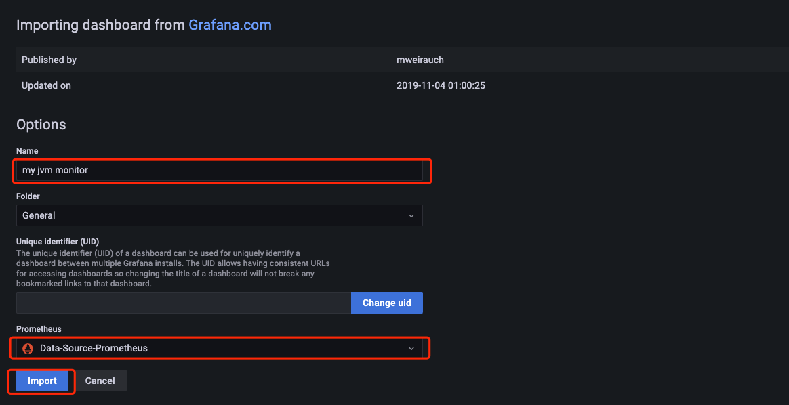

# 使用Spring Actuator + Micrometer + Prometheus + Grafana监控Spring Boot应用程序
+ **[简介](#简介)**
+ **[模块简单介绍](#模块简单介绍)**
+ **[创建示例应用](#创建示例应用)**
+ **[添加Prometheus配置](#添加Prometheus配置)**
+ **[添加Grafana](#添加Grafana)**
+ **[创建示例应用](#创建示例应用)**
## 简介
+ 读取本文需要的知识：Java,Docker基本命令
+ 当某个应用在生产环境中运行时,监控其运行状态是必要的和明智的。通过实时了解应用程序的运行状况,你能在问题出现之前得到警告,也可以在客户端注意到问题之前解决问题。

## 模块简单介绍 
+ Spring Actuator:在应用程序离提供众多Web接口,通过它们了解应用运行时的内部状况。[官网文档](https://docs.spring.io/spring-boot/docs/current/reference/html/actuator.html)
+ Micrometer:为Java平台上的性能数据收集提供了一个通用的API,它提供了多种度量指标类型,同时支持接入 Influxdb,Graphite,Prometheus等。[Github](https://github.com/micrometer-metrics/micrometer)
+ Prometheus:一个时间序列数据库,用于收集指标。[官网文档](https://prometheus.io/)
+ Grafana:数据可视化工具。[官方文档](https://grafana.com/)
+ 下面是数据流向


  
## 创建示例应用
首先要创建可以监控的Spring Boot监控程序,并添加Spring Boot Actuator,Prometheus,Spring Boot Web依赖
```xml
<dependency>
    <groupId>org.springframework.boot</groupId>
    <artifactId>spring-boot-starter-actuator</artifactId>
</dependency>
<dependency>
    <groupId>org.springframework.boot</groupId>
    <artifactId>spring-boot-starter-web</artifactId>
</dependency>
<dependency>
    <groupId>io.micrometer</groupId>
    <artifactId>micrometer-registry-prometheus</artifactId>
    <scope>runtime</scope>
</dependency>
```
创建controller
```java
@RestController
public class MetricsController {

    @GetMapping("/endPoint1")
    public String endPoint1() {
        return "Metrics for endPoint1";
    }

    @GetMapping("/endPoint2")
    public String endPoint2() {
        return "Metrics for endPoint2";
    }
    
}
```  
为了启用Prometheus与micrometer,请添加以下信息到Spring Boot配置文件中
```yaml
management:
  endpoints:
    web:
      exposure:
        # 暴露如下端点
        include: health,info,metrics,prometheus
```
启动应用后,验证应用是否正常
```shell
curl http://localhost:8080/endPoint1
Metrics for endPoint1
curl http://localhost:8080/endPoint2
Metrics for endPoint2
```
验证Spring Actuator接口,为了方便通过python -mjson.tool格式化信息
```shell
curl http://localhost:8080/actuator | python -mjson.tool
...
{
   "_links":{
      "self":{
         "href":"http://localhost:8080/actuator",
         "templated":false
      },
      "health":{
         "href":"http://localhost:8080/actuator/health",
         "templated":false
      },
      "health-path":{
         "href":"http://localhost:8080/actuator/health/{*path}",
         "templated":true
      },
      "info":{
         "href":"http://localhost:8080/actuator/info",
         "templated":false
      }
   }
}
```

默认情况下会显示上面信息。除此之外,Spring Actuator可以提供更多信息，
访问 `http://localhost:8080/actuator/prometheus` 从Prometheus拉取数据,返回了大量可用的指标信息。下面只展示一小部分

```shell
curl http://localhost:8080/actuator/prometheus
# HELP jvm_gc_pause_seconds Time spent in GC pause
# TYPE jvm_gc_pause_seconds summary
jvm_gc_pause_seconds_count{action="end of minor GC",cause="G1 Evacuation Pause",} 2.0
jvm_gc_pause_seconds_sum{action="end of minor GC",cause="G1 Evacuation Pause",} 0.009
...
```

验证Micrometer,Spring Boot2.X在sprinb-boot-actator中引入了micrometer,上面的配置文件已经暴露过了

```shell
curl http://localhost:8080/actuator/metrics | python -mjson.tool
...
{
    "names": [
        "http.server.requests",
        "jvm.buffer.count",
        "jvm.buffer.memory.used",
}
```

## 添加Prometheus配置
+ 由于我们的应用程序中有一个/actuator/Prometheus端点来供抓取数据,因此你现在可以配置Prometheus来监控你的Spring Boot应用。Prometheus有几种安装方法,本文使用Docker运行Prometheus
+ 安装docker步骤省略
+ 使用默认docker镜像仓库拉取Prometheus会出现问题,所以要将docker的默认镜像修改为阿里云镜像,具体方法请百度
+ 需要创建一个`prometheus.yml`用来映射docker容器中的配置文件
```yaml
# 全局配置,可被子job覆盖
global:
  # 多久收集一次数据
  scrape_interval: 5s
  # 多久评估一次规则
  evaluation_interval: 1m
  # 每次收集数据的超时时间
  scrape_timeout: 10s

# 收集数据配置列表
scrape_configs:
  # 轮询任务名称
  - job_name: 'job-fsk-ehr'
    # 请求方式
    scheme: http
    tls_config:
      insecure_skip_verify: true
    # 采集数据展示路径
    metrics_path: '/actuator/prometheus'
    static_configs:
      # 被监控的Spring Boot应用(只能写 ip:port)
      - targets: ['192.168.6.210:8080']
          
  # 如果要监控两个应用,则多增加下面一列       
#  - job_name: 'job-fsk-erp-trade'
#    scheme: http
#    tls_config:
#      insecure_skip_verify: true
#    metrics_path: '/fsk-erp-trade/actuator/prometheus'
#    static_configs:
#      - targets: ['192.168.6.210:8086']
```

搜索prometheus镜像


拉取prometheus镜像
```shell
docker pull prom/prometheus
```

使用如下命令启动docker, --name 指定容器的名字, --network 允许容器访问本地网络, -v 使本地prometheus.yml与容器的prometheus映射,
-d 会创建一个守护式容器在后台运行, prom/prometheus指定创建容器的镜像
```
docker run --name prometheus_demo --network host -v /prometheus配置文件路径/prometheus.yml:/etc/prometheus/prometheus.yml -d prom/prometheus
```

成功启动docker容器后,首先验证Prometheus是否能通过 `http://localhost:9090/targets` 收集数据,State为UP表示没有问题


## 添加Grafana
最后添加的组件是Grafana。尽管Prometheus可以显示指标，但是不够可视化。Grafana帮助我们更在精美的仪表盘中显示指标,下面使用docker安装grafana
+ 搜索grafana镜像


+ 拉取grafana镜像

```shell
docker pull grafana/grafana
```

+ 启动grafana容器
```shell
docker run --name grafana -d -p 3000:3000 grafana/grafana
```

+ 点击 `http://localhost:3000` 就可以访问Grafana了


+ username/password  admin/admin
+ 登录成功后可能需要强制修改密码

+ 接下来要添加一个数据源


+ Prometheus在列表的顶部,选择Prometheus


+ 填写URL,Access选择Browser之后点击Save&test


+ 一切正常后,弹出绿色标签,提示数据源正在工作


+ 配置Grafana仪表盘,这里没有自定义仪表盘,而是导入一些比较常用的监控Spring Boot应用的模板


+ 添加模板ID,这里我选择了4701,还可以选择6756,点击右边load按钮


+ 修改仪表盘名字后,选择一个数据源,点击Import



+ 大功告成


