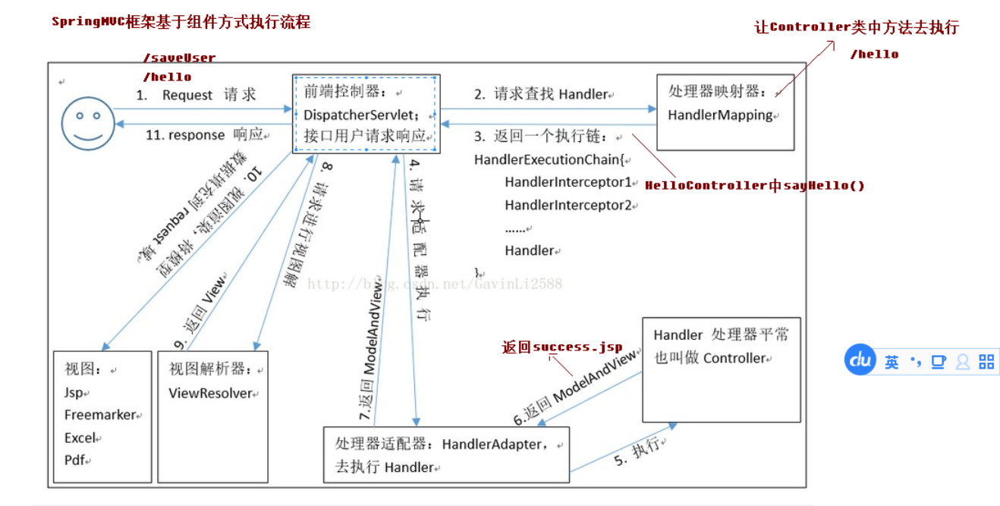

# SpringMVC目录
## SpringMVC工作流程

## SpringMVC中的组件
+ DispatcherServlet(前端控制器)
    ```
    用户请求到达前端控制器，它就相当于 mvc 模式中的 c，dispatcherServlet 是整个流程控制的中心，由
    它调用其它组件处理用户的请求，dispatcherServlet 的存在降低了组件之间的耦合性。
    ```
+ HandlerMapping(处理器映射器)
    ```
    HandlerMapping 负责根据用户请求找到 Handler 即处理器，SpringMVC 提供了不同的映射器实现不同的
    映射方式，例如：配置文件方式，实现接口方式，注解方式等。
    ```
+ Handler(处理器)
    ```
    它就是我们开发中要编写的具体业务控制器。由 DispatcherServlet 把用户请求转发到 Handler。由
    Handler 对具体的用户请求进行处理。
    ```
+ HandlAdapter(处理器适配器)
    ```
    通过 HandlerAdapter 对处理器进行执行，这是适配器模式的应用，通过扩展适配器可以对更多类型的处理
    器进行执行。
    ```
+ View Resolver(视图解析器)
    ```
    View Resolver 负责将处理结果生成 View 视图，View Resolver 首先根据逻辑视图名解析成物理视图名
    即具体的页面地址，再生成 View 视图对象，最后对 View 进行渲染将处理结果通过页面展示给用户。
    ```
+ View(视图)
    ```
    SpringMVC 框架提供了很多的 View 视图类型的支持，包括：jstlView、freemarkerView、pdfView
    等。我们最常用的视图就是 jsp。
    一般情况下需要通过页面标签或页面模版技术将模型数据通过页面展示给用户，需要由程序员根据业务需求开
    发具体的页面。
    ```
所需依赖
```xml
<dependency>
  <groupId>org.springframework</groupId>
  <artifactId>spring-context</artifactId>
  <version>${spring.version}</version>
</dependency>
<dependency>
  <groupId>org.springframework</groupId>
  <artifactId>spring-web</artifactId>
  <version>${spring.version}</version>
</dependency>
<dependency>
  <groupId>org.springframework</groupId>
  <artifactId>spring-webmvc</artifactId>
  <version>${spring.version}</version>
</dependency>
<dependency>
  <groupId>javax.servlet</groupId>
  <artifactId>servlet-api</artifactId>
  <version>2.5</version>
  <scope>provided</scope>
</dependency>
<dependency>
  <groupId>javax.servlet.jsp</groupId>
  <artifactId>jsp-api</artifactId>
  <version>2.0</version>
  <scope>provided</scope>
</dependency>
```
main/resource/springmvc.xml
```xml
<?xml version="1.0" encoding="UTF-8"?>
<beans xmlns="http://www.springframework.org/schema/beans"
       xmlns:mvc="http://www.springframework.org/schema/mvc"
       xmlns:context="http://www.springframework.org/schema/context"
       xmlns:xsi="http://www.w3.org/2001/XMLSchema-instance"
       xsi:schemaLocation="
            http://www.springframework.org/schema/beans
            http://www.springframework.org/schema/beans/spring-beans.xsd
            http://www.springframework.org/schema/mvc
            http://www.springframework.org/schema/mvc/spring-mvc.xsd
            http://www.springframework.org/schema/context
            http://www.springframework.org/schema/context/spring-context.xsd">
    <!--开启注解扫描,HelloController生成实例-->
    <context:component-scan base-package="cn.itcast"/>
    <!--视图解析器-->
    <bean id="internalResourceViewResolver" class="org.springframework.web.servlet.view.InternalResourceViewResolver">
        <!--jsp的前缀-->
        <property name="prefix" value="/WEB-INF/pages/"/>
        <!--jsp的后缀-->
        <property name="suffix" value=".jsp"/>
    </bean>
    <!--开启springmvc框架注解的支持,@RequestMapping注解生效-->
    <mvc:annotation-driven/>
</beans>
```
main/webapp/WEB-INF/web.xml
```xml
<!DOCTYPE web-app PUBLIC
        "-//Sun Microsystems, Inc.//DTD Web Application 2.3//EN"
        "http://java.sun.com/dtd/web-app_2_3.dtd" >

<web-app>
    <display-name>Archetype Created Web Application</display-name>
    <servlet>
        <servlet-name>dispatcherServlet</servlet-name>
        <servlet-class>org.springframework.web.servlet.DispatcherServlet</servlet-class>
        <!--servlet加载后扫描springmvc配置文件-->
        <init-param>
            <param-name>contextConfigLocation</param-name>
            <param-value>classpath:springmvc.xml</param-value>
        </init-param>
        <load-on-startup>1</load-on-startup>
    </servlet>
    <servlet-mapping>
        <servlet-name>dispatcherServlet</servlet-name>
        <url-pattern>/</url-pattern>
    </servlet-mapping>
</web-app>
```
main/java/cn/cast/controller/HelloController.java
```java
@Controller
public class HelloController {
    @RequestMapping("/hello")
    public String sayHello() {
        System.out.println("hello springmvc");
        return "success";
    }
}
```
main/webapp/index.jsp
```jsp
<%@ page contentType="text/html;charset=UTF-8" language="java" %>
<html>
<head>
    <title>Title</title>
</head>
<body>
    <h3>入门程序</h3>
    <a href="hello">入门程序</a>
</body>
</html>
```
main/webapp/WEB-INF/pages/success.jsp
```jsp
<%@ page contentType="text/html;charset=UTF-8" language="java" %>
<html>
<head>
    <title>Title</title>
</head>
<body>
success
</body>
</html>
```
## SpringMVC常用的注解
### @RequestMapping
+ 作用
    + 作用于建立请求URL和处理请求方法之间的联系
+ 参数
    + value="hello" 路径
    + method={RequestMethod.POST} 请求方式
    + params={"username"} 发送请求的时候必须带上username这个属性,不传不执行
    + params={"username=hehe"} 发送请求的时候必须带上username=hehe这个属性,不传不执行
    + headers={"Accept"} 发送请求的时候必须带上Accept这个请求头
