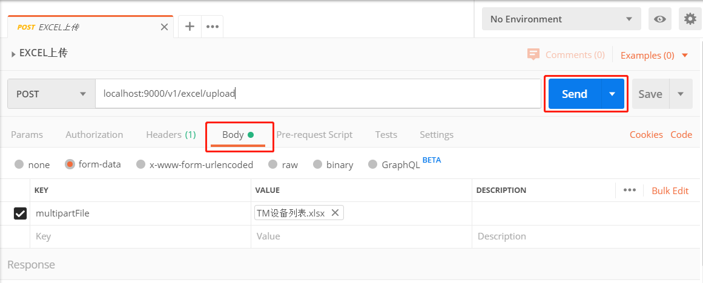

# SpringMVC目录
+ **SpringMVC工作流程**
+ **SpringMVC中的组件**
+ **SpringMVC简单使用**
+ **SpringMVC参数绑定**
    + **实体类型**
    + **集合类型和map类型**
+ **配置中文乱码**
+ **获取Servlet原生API**
+ **SpringMVC常用的注解**
    + **@RequestMapping @RequestParam @RequestBody @PathVariable @RequestHeader @CookieValue @ModelAttribute @SessionAttributes @ResponseBody**
+ **SpringMVC文件上传**
    + **使用postman上传文件**
    + **跨服务器上传文件**
+ **SpringMVC异常处理**
+ **SpringMVC拦截器**


## SpringMVC工作流程

## SpringMVC中的组件
+ DispatcherServlet(前端控制器)
    ```
    用户请求到达前端控制器，它就相当于 mvc 模式中的 c，dispatcherServlet 是整个流程控制的中心，由
    它调用其它组件处理用户的请求，dispatcherServlet 的存在降低了组件之间的耦合性。
    ```
+ HandlerMapping(处理器映射器)
    ```
    HandlerMapping 负责根据用户请求找到 Handler 即处理器，SpringMVC 提供了不同的映射器实现不同的
    映射方式，例如：配置文件方式，实现接口方式，注解方式等。
    ```
+ Handler(处理器)
    ```
    它就是我们开发中要编写的具体业务控制器。由 DispatcherServlet 把用户请求转发到 Handler。由
    Handler 对具体的用户请求进行处理。
    ```
+ HandlAdapter(处理器适配器)
    ```
    通过 HandlerAdapter 对处理器进行执行，这是适配器模式的应用，通过扩展适配器可以对更多类型的处理
    器进行执行。
    ```
+ View Resolver(视图解析器)
    ```
    View Resolver 负责将处理结果生成 View 视图，View Resolver 首先根据逻辑视图名解析成物理视图名
    即具体的页面地址，再生成 View 视图对象，最后对 View 进行渲染将处理结果通过页面展示给用户。
    ```
+ View(视图)
    ```
    SpringMVC 框架提供了很多的 View 视图类型的支持，包括：jstlView、freemarkerView、pdfView
    等。我们最常用的视图就是 jsp。
    一般情况下需要通过页面标签或页面模版技术将模型数据通过页面展示给用户，需要由程序员根据业务需求开
    发具体的页面。
    ```
## SpringMVC简单使用  
所需依赖
```xml
<dependency>
  <groupId>org.springframework</groupId>
  <artifactId>spring-context</artifactId>
  <version>${spring.version}</version>
</dependency>
<dependency>
  <groupId>org.springframework</groupId>
  <artifactId>spring-web</artifactId>
  <version>${spring.version}</version>
</dependency>
<dependency>
  <groupId>org.springframework</groupId>
  <artifactId>spring-webmvc</artifactId>
  <version>${spring.version}</version>
</dependency>
<dependency>
  <groupId>javax.servlet</groupId>
  <artifactId>servlet-api</artifactId>
  <version>2.5</version>
  <scope>provided</scope>
</dependency>
<dependency>
  <groupId>javax.servlet.jsp</groupId>
  <artifactId>jsp-api</artifactId>
  <version>2.0</version>
  <scope>provided</scope>
</dependency>
```
main/resource/springmvc.xml
```xml
<?xml version="1.0" encoding="UTF-8"?>
<beans xmlns="http://www.springframework.org/schema/beans"
       xmlns:mvc="http://www.springframework.org/schema/mvc"
       xmlns:context="http://www.springframework.org/schema/context"
       xmlns:xsi="http://www.w3.org/2001/XMLSchema-instance"
       xsi:schemaLocation="
            http://www.springframework.org/schema/beans
            http://www.springframework.org/schema/beans/spring-beans.xsd
            http://www.springframework.org/schema/mvc
            http://www.springframework.org/schema/mvc/spring-mvc.xsd
            http://www.springframework.org/schema/context
            http://www.springframework.org/schema/context/spring-context.xsd">
    <!--开启注解扫描,HelloController生成实例-->
    <context:component-scan base-package="cn.itcast"/>
    <!--视图解析器-->
    <bean id="internalResourceViewResolver" class="org.springframework.web.servlet.view.InternalResourceViewResolver">
        <!--jsp的前缀-->
        <property name="prefix" value="/WEB-INF/pages/"/>
        <!--jsp的后缀-->
        <property name="suffix" value=".jsp"/>
    </bean>
    <!--开启springmvc框架注解的支持,@RequestMapping注解生效-->
    <mvc:annotation-driven/>
</beans>
```
main/webapp/WEB-INF/web.xml
```xml
<!DOCTYPE web-app PUBLIC
        "-//Sun Microsystems, Inc.//DTD Web Application 2.3//EN"
        "http://java.sun.com/dtd/web-app_2_3.dtd" >

<web-app>
    <display-name>Archetype Created Web Application</display-name>
    <servlet>
        <servlet-name>dispatcherServlet</servlet-name>
        <servlet-class>org.springframework.web.servlet.DispatcherServlet</servlet-class>
        <!--servlet加载后扫描springmvc配置文件-->
        <init-param>
            <param-name>contextConfigLocation</param-name>
            <param-value>classpath:springmvc.xml</param-value>
        </init-param>
        <load-on-startup>1</load-on-startup>
    </servlet>
    <servlet-mapping>
        <servlet-name>dispatcherServlet</servlet-name>
        <url-pattern>/</url-pattern>
    </servlet-mapping>
</web-app>
```
main/java/cn/cast/controller/HelloController.java
```java
@Controller
public class HelloController {
    @RequestMapping("/hello")
    public String sayHello() {
        System.out.println("hello springmvc");
        return "success";
    }
}
```
main/webapp/index.jsp
```jsp
<%@ page contentType="text/html;charset=UTF-8" language="java" %>
<html>
<head>
    <title>Title</title>
</head>
<body>
    <h3>入门程序</h3>
    <a href="hello">入门程序</a>
</body>
</html>
```
main/webapp/WEB-INF/pages/success.jsp
```jsp
<%@ page contentType="text/html;charset=UTF-8" language="java" %>
<html>
<head>
    <title>Title</title>
</head>
<body>
success
</body>
</html>
```
## SpringMVC参数绑定
### 实体类型
```jsp
<form action="param/saveAccount" method="post">
    姓名：<input type="text" name="username"/><br/>
    密码：<input type="text" name="password"/><br/>
    金额：<input type="text" name="money"/><br/>
    <input type="submit" value="提交"/>
</form>
```
实体类型中还有实体
```jsp
<form action="param/saveAccount" method="post">
    姓名：<input type="text" name="username"/><br/>
    密码：<input type="text" name="password"/><br/>
    金额：<input type="text" name="money"/><br/>
    用户姓名：<input type="text" name="user.uname"/><br/>
    用户年龄：<input type="text" name="user.age"/><br/>
    <input type="submit" value="提交"/>
</form>
```
### 集合类型和map类型
```java
public class Account implements Serializable {
    private String username;
    private String password;
    private Double money;

    private List<User> list;
    private Map<String, User> map;
    // get and set ...
}
```
```jsp
<form action="param/saveAccount" method="post">
    姓名：<input type="text" name="username"/><br/>
    密码：<input type="text" name="password"/><br/>
    金额：<input type="text" name="money"/><br/>

    用户姓名：<input type="text" name="list[0].uname"/><br/>
    用户年龄：<input type="text" name="list[0].age"/><br/>

    用户年龄：<input type="text" name="map['one'].uname"/><br/>
    用户年龄：<input type="text" name="map['one'].age"/><br/>

    <input type="submit" value="提交"/>
</form>
```
## 配置中文乱码
web.xml
```xml
<!--解决中文乱码过滤器-->
<filter>
    <filter-name>filter</filter-name>
    <filter-class>org.springframework.web.filter.CharacterEncodingFilter</filter-class>
    <init-param>
        <param-name>encoding</param-name>
        <param-value>UTF-8</param-value>
    </init-param>
</filter>
<filter-mapping>
    <filter-name>filter</filter-name>
    <url-pattern>/*</url-pattern>
</filter-mapping>
```
## 获取Servlet原生API
```java
@RequestMapping("/testServlet")
public String testServlet(HttpServletRequest request, HttpServletResponse reponse) {
    System.out.println(request);

    System.out.println(response);

    HttpSession session = request.getSession();
    System.out.println(session);

    ServletContext servletContext = session.getServletContext();
    System.out.println(servletContext);
    return "success";
}
```

## SpringMVC常用的注解
### @RequestMapping
+ 作用
    + 作用于建立请求URL和处理请求方法之间的联系
+ 参数
    + value="hello" 路径
    + method={RequestMethod.POST} 请求方式
    + params={"username"} 发送请求的时候必须带上username这个属性,不传不执行
    + params={"username=hehe"} 发送请求的时候必须带上username=hehe这个属性,不传不执行
    + headers={"Accept"} 发送请求的时候必须带上Accept这个请求头
### @RequestParam
+ 作用
    + 把请求中指定名称的参数给控制器中的形参赋值
+ 属性
    + value 请求参数中的名称
    + required 请求参数中是否必须提供此参数。默认值true
```java
@RequestMapping("test")
public void test(@RequestParam("name")String name){
    System.out.println(name);
}    
```    
### @RequestBody
+ 作用
    + 用于获取请求体内容。直接使用得到的是 key=value&key=value...结构的数据
+ 属性
    + required：是否必须有请求体。默认值true
```java
@RequestMapping("test")
public void test(@RequestBody String body){
    // username=张三&age=20
    System.out.println(body);
}
```    
### @PathVariable
+ 作用
    + 获取url中的占位符的值。
```java
// localhost:8080/testPathVariable/10
  
@RequestMapping("/test/{sid}")
public void test(@PathVariable(name="sid") String id){
    // 10
    System.out.println(id);
}
```
### @RequestHeader
+ 作用
    + 获取请求头消息
```java
@RequestMapping("test")
public void test(@RequestHeader(value = "Accept")String header){
    // text/html,application/xhtml+xml,application/xml;q=0.9,*/*;q=0.8
    System.out.println(header);
}
```
### @CookieValue
+ 作用
    + 获取指定cookie的值
```java
@RequestMapping("test")
public void test(@CookieValue(value = "JSESSIONID")String cookieValue){
    System.out.println(cookieValue);
}
```
### @ModelAttribute
+ 作用
    + 1.修饰在方法上,表示当前方法会在控制器的方法执行之前执行
```java
@RequestMapping(value = "test")
public String test1() {
    System.out.println("test1");
}
@ModelAttribute(){
    System.out.println("test2");
}

// 访问test1方法控制台打印的结果为 test2 test1
```
### @SessionAttributes
+ 作用
    + 用于多次执行控制器方法间的参数共享
+ 属性
    + value：用于指定存入的属性名称
    + type：用于指定存入的数据类型
```java
@Controller
@RequestMapping(path="/user")
// 把数据存入到session域对象中
@SessionAttributes(value= {"username","password","age"},types={String.class,Integer.class})
public class HelloController {
    /**
    * 向session中存入值
    * @return
    */
    @RequestMapping(path="/save")
    public String save(Model model) {
        System.out.println("向session域中保存数据");
        model.addAttribute("username", "root");
        model.addAttribute("password", "123");
        model.addAttribute("age", 20);
        return "success";
    }
    /**
    * 从session中获取值
    * @return
    */
    @RequestMapping(path="/find")
    public String find(ModelMap modelMap) {
        String username = (String) modelMap.get("username");
        String password = (String) modelMap.get("password");
        Integer age = (Integer) modelMap.get("age");
        System.out.println(username + " : "+password +" : "+age);
        return "success";
    }
    /**
    * 清除值
    * @return
    */
    @RequestMapping(path="/delete")
    public String delete(SessionStatus status) {
        status.setComplete();
        return "success";
    }
}
```
### @ResponseBody
+ 作用
    + JavaBean对象转换成json字符串，直接响应
## SpringMVC文件上传
+ 1.form表单的enctype的取值必须是multipart/formdata(默认值是application/x-www-form-urlencoded)
+ 2.method的属性必须是post
+ 3.提供一个文件选择域 `<input type="file"/>`
+ 原理

### 使用postman上传文件



```java
// Springboot导入的web依赖，无需springmvc的jar包以及springmvc.xml配置文件
@RestController
public class ExcelController {

    @PostMapping("/v1/excel/upload")
    public Object uploadExcel(@RequestParam("multipartFile") MultipartFile multipartFile) {
        String fileName = multipartFile.getOriginalFilename();
        // 项目目录下要有excel目录
        String filePath = System.getProperty("user.dir") + "/excel/";
        multipartFile.transferTo(new File(filePath, fileName));
        return "success";
    }
}
```
### 跨服务器上传文件
+ 0.需要的jar包
```xml
<dependency>
    <groupId>com.sun.jersey</groupId>
    <artifactId>jersey-core</artifactId>
    <version>1.18.1</version>
</dependency>
<dependency>
    <groupId>com.sun.jersey</groupId>
    <artifactId>jersey-client</artifactId>
    <version>1.18.1</version>
</dependency>
```
+ 1.模拟文件服务器
    + 创建一个新项目，修改http端口和jmx端口

+ 2.文件上传的jsp页面
```jsp
<h3>跨服务器的文件上传</h3>
<form action="user/fileupload3" method="post" enctype="multipart/form-data">
    选择文件：<input type="file" name="upload"/><br/>
    <input type="submit" value="上传文件"/>
</form>
```
+ 3.controller
```java
@RequestMapping(value="/fileupload3")
public String fileupload3(MultipartFile upload) throws Exception {
    System.out.println("SpringMVC跨服务器方式的文件上传...");
    // 定义图片服务器的请求路径
    String path = "http://localhost:9090/xxx/";
    // 获取到上传文件的名称
    String filename = upload.getOriginalFilename();
    String uuid = UUID.randomUUID().toString().replaceAll("-", "").toUpperCase();
    // 把文件的名称唯一化
    filename = uuid+"_"+filename;
    // 向图片服务器上传文件
    // 创建客户端对象
    Client client = Client.create();
    // 连接图片服务器
    WebResource webResource = client.resource(path+filename);
    // 上传文件
    webResource.put(upload.getBytes());
    return "success";
```
## SpringMVC异常处理
**不处理异常页面上会直接看到异常**

**使用异常处理器处理后跳转到指定页面**

代码
```xml
<!-- 配置异常处理器 -->
<bean id="sysExceptionResolver" class="cn.itcast.exception.SysExceptionResolver"/>
```
```java
// 自定义异常类
public class SysException extends Exception{
    private static final long serialVersionUID = 4055945147128016300L;
    // 异常提示信息
    private String message;
    public String getMessage() {
        return message;
    }
    public void setMessage(String message) {
        this.message = message;
    }
    public SysException(String message) {
        this.message = message;
    }
}
```
```java
public class SysExceptionResolver implements HandlerExceptionResolver{
    /**
    * 跳转到具体的错误页面的方法
    */
    public ModelAndView resolveException(HttpServletRequest request, HttpServletResponse response, Object handler, Exception ex) {
        ex.printStackTrace();
        SysException e = null;
        // 获取到异常对象
        if(ex instanceof SysException) {
            e = (SysException) ex;
        }else {
            e = new SysException("请联系管理员");
        }
        ModelAndView mv = new ModelAndView();
        // 存入错误的提示信息
        mv.addObject("message", e.getMessage());
        // 跳转的Jsp页面
        mv.setViewName("error");
        return mv;
    }
}
```
## SpringMVC拦截器
+ 拦截器
    + SpringMVC的处理器拦截器类似于Servlet开发中的过滤器Filter，用于对处理器进行预处理和后处理。用户可以自己定义拦截器来实现特定的功能。
+ 拦截器链
    + 就是将拦截器按照一定的顺序结成一条链，在访问被拦截的方法或者字段时，拦截器链中的拦截器就会按照之前定义的顺序被调用
+ 拦截器和过滤器的区别
    + 过滤器是servlet规范中的一部分，任何javaweb功能都能用
    + 拦截器是springmvc框架自己的
    + 过滤器在url-pattern中配置了/*之后，可以对所有要访问的资源拦截。
    + 拦截器它只会拦截访问的控制器方法，如果访问的是jsp，html，css，image或者js是不会进行拦截
    + 拦截器也是aop思想的具体引用
    + 自定义的拦截器必须实现HandlerInterceptor接口
### 代码
```xml
<!-- 配置拦截器 -->
<mvc:interceptors>
    <mvc:interceptor>
        <!-- 哪些方法进行拦截 -->
        <mvc:mapping path="/user/*"/>
        <!-- 哪些方法不进行拦截
        <mvc:exclude-mapping path=""/>
        -->
        <!-- 注册拦截器对象 -->
        <bean class="cn.itcast.demo1.MyInterceptor1"/>
    </mvc:interceptor>
</mvc:interceptors>
```
```java
/**
* 自定义拦截器1
*/
public class MyInterceptor1 implements HandlerInterceptor{
    /**
    * controller方法执行前，进行拦截的方法
    * return true放行
    * return false拦截
    * 可以使用转发或者重定向直接跳转到指定的页面。
    */
    public boolean preHandle(HttpServletRequest request, HttpServletResponse response, Object handler) throws Exception {
        System.out.println("拦截器执行了...");
        return true;
    }
}
```
### HandlerInterceptor接口中的方法
+ 1.preHandle方法是controller方法执行前拦截的方法
    + 可以用request或者response跳转到指定的页面
    + return true放行，执行下一个拦截器，如果没有拦截器，执行controller中的方法
    + return false不放行，不会执行controller中的方法
+ 2.postHandle是controller方法执行后执行的方法，在jsp试图执行之前
    + 可以使用request或者response跳转到指定的页面
    + 如果指定了跳转的页面，那么controller方法跳转的页面将不会显示
+ 3.afterCompletion方法是在jsp执行后执行
    + request或者response不能再跳转页面了